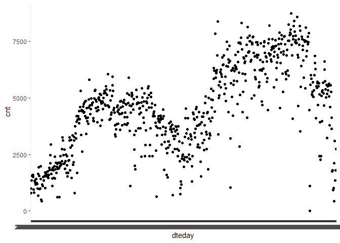
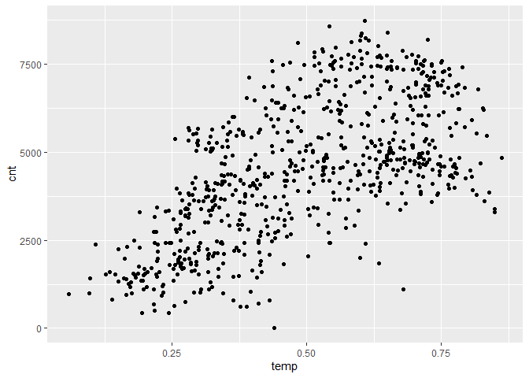
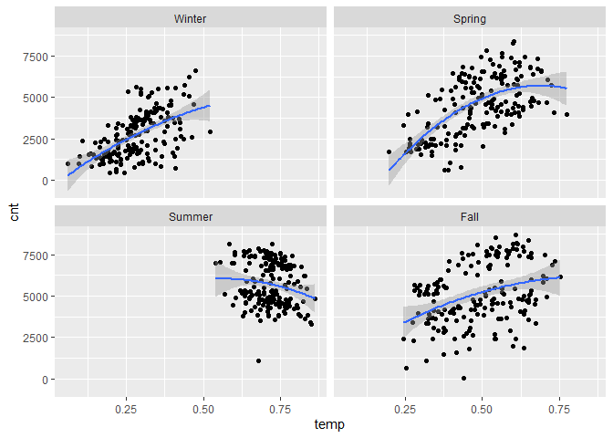

## Exploring the bike data characteristics

We're exploring the bike data to look at the relationship between **temperature** and **riders.**

### Step 0: Load tidyverse


```r
library(tidyverse)
```

```
## -- Attaching packages --------------------------------------- tidyverse 1.3.1 --
```

```
## v ggplot2 3.3.4     v purrr   0.3.4
## v tibble  3.1.2     v dplyr   1.0.7
## v tidyr   1.1.3     v stringr 1.4.0
## v readr   1.4.0     v forcats 0.5.1
```

```
## -- Conflicts ------------------------------------------ tidyverse_conflicts() --
## x dplyr::filter() masks stats::filter()
## x dplyr::lag()    masks stats::lag()
```


### Step 1: Load the bike data and look at the metadata


```r
#loading bike data
bike <- read.csv("data/daily_bike_data.csv")
head(bike)
```

```
##   instant     dteday season   yr    mnth     holiday   weekday  workingday
## 1       1 2011-01-01 spring 2011 January not holiday  Saturday not workday
## 2       2 2011-01-02 spring 2011 January not holiday    Sunday not workday
## 3       3 2011-01-03 spring 2011 January not holiday    Monday     workday
## 4       4 2011-01-04 spring 2011 January not holiday   Tuesday     workday
## 5       5 2011-01-05 spring 2011 January not holiday Wednesday     workday
## 6       6 2011-01-06 spring 2011 January not holiday  Thursday     workday
##   weathersit     temp    atemp      hum windspeed casual registered  cnt
## 1          2 0.344167 0.363625 0.805833 0.1604460    331        654  985
## 2          2 0.363478 0.353739 0.696087 0.2485390    131        670  801
## 3          1 0.196364 0.189405 0.437273 0.2483090    120       1229 1349
## 4          1 0.200000 0.212122 0.590435 0.1602960    108       1454 1562
## 5          1 0.226957 0.229270 0.436957 0.1869000     82       1518 1600
## 6          1 0.204348 0.233209 0.518261 0.0895652     88       1518 1606
```

```r
str(bike)
```

```
## 'data.frame':	731 obs. of  16 variables:
##  $ instant   : int  1 2 3 4 5 6 7 8 9 10 ...
##  $ dteday    : chr  "2011-01-01" "2011-01-02" "2011-01-03" "2011-01-04" ...
##  $ season    : chr  "spring" "spring" "spring" "spring" ...
##  $ yr        : int  2011 2011 2011 2011 2011 2011 2011 2011 2011 2011 ...
##  $ mnth      : chr  "January" "January" "January" "January" ...
##  $ holiday   : chr  "not holiday" "not holiday" "not holiday" "not holiday" ...
##  $ weekday   : chr  "Saturday" "Sunday" "Monday" "Tuesday" ...
##  $ workingday: chr  "not workday" "not workday" "workday" "workday" ...
##  $ weathersit: int  2 2 1 1 1 1 2 2 1 1 ...
##  $ temp      : num  0.344 0.363 0.196 0.2 0.227 ...
##  $ atemp     : num  0.364 0.354 0.189 0.212 0.229 ...
##  $ hum       : num  0.806 0.696 0.437 0.59 0.437 ...
##  $ windspeed : num  0.16 0.249 0.248 0.16 0.187 ...
##  $ casual    : int  331 131 120 108 82 88 148 68 54 41 ...
##  $ registered: int  654 670 1229 1454 1518 1518 1362 891 768 1280 ...
##  $ cnt       : int  985 801 1349 1562 1600 1606 1510 959 822 1321 ...
```

```r
sort(names(bike))
```

```
##  [1] "atemp"      "casual"     "cnt"        "dteday"     "holiday"   
##  [6] "hum"        "instant"    "mnth"       "registered" "season"    
## [11] "temp"       "weathersit" "weekday"    "windspeed"  "workingday"
## [16] "yr"
```


```r
#Time trend of ridership

ggplot(bike,aes(x= dteday, y = cnt))+
  geom_point()
```

<!-- -->

```r
ggplot(bike,aes(x= temp, y = cnt))+
  geom_point()
```

<!-- -->


```r
# dplyr verbs for data transformations
#   select: select columns to keep
#   filter: select rows to keep
#   mutate: transforms data while keep other columns
#   transmute: creates new columns and does not keep old columns
#   %>%: "pipe" pipes de output from one command as input for next command

bike %>% select(dteday, season, weathersit, temp, cnt)
```

```
##         dteday season weathersit      temp  cnt
## 1   2011-01-01 spring          2 0.3441670  985
## 2   2011-01-02 spring          2 0.3634780  801
## 3   2011-01-03 spring          1 0.1963640 1349
## 4   2011-01-04 spring          1 0.2000000 1562
## 5   2011-01-05 spring          1 0.2269570 1600
## 6   2011-01-06 spring          1 0.2043480 1606
## 7   2011-01-07 spring          2 0.1965220 1510
## 8   2011-01-08 spring          2 0.1650000  959
## 9   2011-01-09 spring          1 0.1383330  822
## 10  2011-01-10 spring          1 0.1508330 1321
## 11  2011-01-11 spring          2 0.1690910 1263
## 12  2011-01-12 spring          1 0.1727270 1162
## 13  2011-01-13 spring          1 0.1650000 1406
## 14  2011-01-14 spring          1 0.1608700 1421
## 15  2011-01-15 spring          2 0.2333330 1248
## 16  2011-01-16 spring          1 0.2316670 1204
## 17  2011-01-17 spring          2 0.1758330 1000
## 18  2011-01-18 spring          2 0.2166670  683
## 19  2011-01-19 spring          2 0.2921740 1650
## 20  2011-01-20 spring          2 0.2616670 1927
## 21  2011-01-21 spring          1 0.1775000 1543
## 22  2011-01-22 spring          1 0.0591304  981
## 23  2011-01-23 spring          1 0.0965217  986
## 24  2011-01-24 spring          1 0.0973913 1416
## 25  2011-01-25 spring          2 0.2234780 1985
## 26  2011-01-26 spring          3 0.2175000  506
## 27  2011-01-27 spring          1 0.1950000  431
## 28  2011-01-28 spring          2 0.2034780 1167
## 29  2011-01-29 spring          1 0.1965220 1098
## 30  2011-01-30 spring          1 0.2165220 1096
## 31  2011-01-31 spring          2 0.1808330 1501
## 32  2011-02-01 spring          2 0.1921740 1360
## 33  2011-02-02 spring          2 0.2600000 1526
## 34  2011-02-03 spring          1 0.1869570 1550
## 35  2011-02-04 spring          2 0.2113040 1708
## 36  2011-02-05 spring          2 0.2333330 1005
## 37  2011-02-06 spring          1 0.2858330 1623
## 38  2011-02-07 spring          1 0.2716670 1712
## 39  2011-02-08 spring          1 0.2208330 1530
## 40  2011-02-09 spring          2 0.1347830 1605
## 41  2011-02-10 spring          1 0.1443480 1538
## 42  2011-02-11 spring          1 0.1890910 1746
## 43  2011-02-12 spring          1 0.2225000 1472
## 44  2011-02-13 spring          1 0.3165220 1589
## 45  2011-02-14 spring          1 0.4150000 1913
## 46  2011-02-15 spring          1 0.2660870 1815
## 47  2011-02-16 spring          1 0.3182610 2115
## 48  2011-02-17 spring          1 0.4358330 2475
## 49  2011-02-18 spring          1 0.5216670 2927
## 50  2011-02-19 spring          1 0.3991670 1635
## 51  2011-02-20 spring          1 0.2852170 1812
## 52  2011-02-21 spring          2 0.3033330 1107
## 53  2011-02-22 spring          1 0.1822220 1450
## 54  2011-02-23 spring          1 0.2217390 1917
## 55  2011-02-24 spring          2 0.2956520 1807
## 56  2011-02-25 spring          2 0.3643480 1461
## 57  2011-02-26 spring          1 0.2825000 1969
## 58  2011-02-27 spring          1 0.3434780 2402
## 59  2011-02-28 spring          2 0.4072730 1446
## 60  2011-03-01 spring          1 0.2666670 1851
## 61  2011-03-02 spring          1 0.3350000 2134
## 62  2011-03-03 spring          1 0.1983330 1685
## 63  2011-03-04 spring          2 0.2616670 1944
## 64  2011-03-05 spring          2 0.3841670 2077
## 65  2011-03-06 spring          2 0.3765220  605
## 66  2011-03-07 spring          1 0.2617390 1872
## 67  2011-03-08 spring          1 0.2925000 2133
## 68  2011-03-09 spring          2 0.2958330 1891
## 69  2011-03-10 spring          3 0.3890910  623
## 70  2011-03-11 spring          2 0.3165220 1977
## 71  2011-03-12 spring          1 0.3291670 2132
## 72  2011-03-13 spring          1 0.3843480 2417
## 73  2011-03-14 spring          1 0.3252170 2046
## 74  2011-03-15 spring          2 0.3173910 2056
## 75  2011-03-16 spring          2 0.3652170 2192
## 76  2011-03-17 spring          1 0.4150000 2744
## 77  2011-03-18 spring          1 0.5400000 3239
## 78  2011-03-19 spring          1 0.4725000 3117
## 79  2011-03-20 spring          1 0.3325000 2471
## 80  2011-03-21 summer          2 0.4304350 2077
## 81  2011-03-22 summer          1 0.4416670 2703
## 82  2011-03-23 summer          2 0.3469570 2121
## 83  2011-03-24 summer          2 0.2850000 1865
## 84  2011-03-25 summer          1 0.2641670 2210
## 85  2011-03-26 summer          1 0.2658330 2496
## 86  2011-03-27 summer          2 0.2530430 1693
## 87  2011-03-28 summer          1 0.2643480 2028
## 88  2011-03-29 summer          1 0.3025000 2425
## 89  2011-03-30 summer          2 0.3000000 1536
## 90  2011-03-31 summer          3 0.2683330 1685
## 91  2011-04-01 summer          2 0.3000000 2227
## 92  2011-04-02 summer          2 0.3150000 2252
## 93  2011-04-03 summer          1 0.3783330 3249
## 94  2011-04-04 summer          1 0.5733330 3115
## 95  2011-04-05 summer          2 0.4141670 1795
## 96  2011-04-06 summer          1 0.3908330 2808
## 97  2011-04-07 summer          1 0.4375000 3141
## 98  2011-04-08 summer          2 0.3358330 1471
## 99  2011-04-09 summer          2 0.3425000 2455
## 100 2011-04-10 summer          2 0.4266670 2895
## 101 2011-04-11 summer          2 0.5956520 3348
## 102 2011-04-12 summer          2 0.5025000 2034
## 103 2011-04-13 summer          2 0.4125000 2162
## 104 2011-04-14 summer          1 0.4675000 3267
## 105 2011-04-15 summer          1 0.4466670 3126
## 106 2011-04-16 summer          3 0.4308330  795
## 107 2011-04-17 summer          1 0.4566670 3744
## 108 2011-04-18 summer          1 0.5125000 3429
## 109 2011-04-19 summer          2 0.5058330 3204
## 110 2011-04-20 summer          1 0.5950000 3944
## 111 2011-04-21 summer          1 0.4591670 4189
## 112 2011-04-22 summer          2 0.3366670 1683
## 113 2011-04-23 summer          2 0.4600000 4036
## 114 2011-04-24 summer          2 0.5816670 4191
## 115 2011-04-25 summer          1 0.6066670 4073
## 116 2011-04-26 summer          1 0.6316670 4400
## 117 2011-04-27 summer          2 0.6200000 3872
## 118 2011-04-28 summer          2 0.6175000 4058
## 119 2011-04-29 summer          1 0.5100000 4595
## 120 2011-04-30 summer          1 0.4725000 5312
## 121 2011-05-01 summer          2 0.4516670 3351
## 122 2011-05-02 summer          2 0.5491670 4401
## 123 2011-05-03 summer          2 0.6166670 4451
## 124 2011-05-04 summer          2 0.4141670 2633
## 125 2011-05-05 summer          1 0.4591670 4433
## 126 2011-05-06 summer          1 0.4791670 4608
## 127 2011-05-07 summer          1 0.5200000 4714
## 128 2011-05-08 summer          1 0.5283330 4333
## 129 2011-05-09 summer          1 0.5325000 4362
## 130 2011-05-10 summer          1 0.5325000 4803
## 131 2011-05-11 summer          1 0.5425000 4182
## 132 2011-05-12 summer          1 0.5350000 4864
## 133 2011-05-13 summer          2 0.5125000 4105
## 134 2011-05-14 summer          2 0.5208330 3409
## 135 2011-05-15 summer          2 0.5625000 4553
## 136 2011-05-16 summer          1 0.5775000 3958
## 137 2011-05-17 summer          2 0.5616670 4123
## 138 2011-05-18 summer          2 0.5500000 3855
## 139 2011-05-19 summer          2 0.5308330 4575
## 140 2011-05-20 summer          1 0.5366670 4917
## 141 2011-05-21 summer          1 0.6025000 5805
## 142 2011-05-22 summer          1 0.6041670 4660
## 143 2011-05-23 summer          2 0.6316670 4274
## 144 2011-05-24 summer          2 0.6600000 4492
## 145 2011-05-25 summer          1 0.6608330 4978
## 146 2011-05-26 summer          1 0.7083330 4677
## 147 2011-05-27 summer          1 0.6816670 4679
## 148 2011-05-28 summer          1 0.6558330 4758
## 149 2011-05-29 summer          1 0.6675000 4788
## 150 2011-05-30 summer          1 0.7333330 4098
## 151 2011-05-31 summer          1 0.7750000 3982
## 152 2011-06-01 summer          2 0.7641670 3974
## 153 2011-06-02 summer          1 0.7150000 4968
## 154 2011-06-03 summer          1 0.6200000 5312
## 155 2011-06-04 summer          1 0.6350000 5342
## 156 2011-06-05 summer          2 0.6483330 4906
## 157 2011-06-06 summer          1 0.6783330 4548
## 158 2011-06-07 summer          1 0.7075000 4833
## 159 2011-06-08 summer          1 0.7758330 4401
## 160 2011-06-09 summer          2 0.8083330 3915
## 161 2011-06-10 summer          1 0.7550000 4586
## 162 2011-06-11 summer          1 0.7250000 4966
## 163 2011-06-12 summer          1 0.6925000 4460
## 164 2011-06-13 summer          1 0.6350000 5020
## 165 2011-06-14 summer          1 0.6041670 4891
## 166 2011-06-15 summer          1 0.6266670 5180
## 167 2011-06-16 summer          2 0.6283330 3767
## 168 2011-06-17 summer          1 0.6491670 4844
## 169 2011-06-18 summer          1 0.6966670 5119
## 170 2011-06-19 summer          2 0.6991670 4744
## 171 2011-06-20 summer          2 0.6350000 4010
## 172 2011-06-21   fall          2 0.6808330 4835
## 173 2011-06-22   fall          1 0.7333330 4507
## 174 2011-06-23   fall          2 0.7283330 4790
## 175 2011-06-24   fall          1 0.7241670 4991
## 176 2011-06-25   fall          1 0.6950000 5202
## 177 2011-06-26   fall          1 0.6800000 5305
## 178 2011-06-27   fall          2 0.6825000 4708
## 179 2011-06-28   fall          1 0.7441670 4648
## 180 2011-06-29   fall          1 0.7283330 5225
## 181 2011-06-30   fall          1 0.6966670 5515
## 182 2011-07-01   fall          1 0.7225000 5362
## 183 2011-07-02   fall          1 0.7383330 5119
## 184 2011-07-03   fall          2 0.7166670 4649
## 185 2011-07-04   fall          2 0.7266670 6043
## 186 2011-07-05   fall          1 0.7466670 4665
## 187 2011-07-06   fall          1 0.7200000 4629
## 188 2011-07-07   fall          1 0.7500000 4592
## 189 2011-07-08   fall          2 0.7091670 4040
## 190 2011-07-09   fall          1 0.7333330 5336
## 191 2011-07-10   fall          1 0.7475000 4881
## 192 2011-07-11   fall          1 0.7625000 4086
## 193 2011-07-12   fall          1 0.7941670 4258
## 194 2011-07-13   fall          1 0.7466670 4342
## 195 2011-07-14   fall          1 0.6808330 5084
## 196 2011-07-15   fall          1 0.6633330 5538
## 197 2011-07-16   fall          1 0.6866670 5923
## 198 2011-07-17   fall          1 0.7191670 5302
## 199 2011-07-18   fall          1 0.7466670 4458
## 200 2011-07-19   fall          1 0.7766670 4541
## 201 2011-07-20   fall          1 0.7683330 4332
## 202 2011-07-21   fall          2 0.8150000 3784
## 203 2011-07-22   fall          1 0.8483330 3387
## 204 2011-07-23   fall          1 0.8491670 3285
## 205 2011-07-24   fall          1 0.8300000 3606
## 206 2011-07-25   fall          1 0.7433330 3840
## 207 2011-07-26   fall          1 0.7716670 4590
## 208 2011-07-27   fall          1 0.7750000 4656
## 209 2011-07-28   fall          1 0.7791670 4390
## 210 2011-07-29   fall          1 0.8383330 3846
## 211 2011-07-30   fall          1 0.8041670 4475
## 212 2011-07-31   fall          1 0.8058330 4302
## 213 2011-08-01   fall          1 0.7716670 4266
## 214 2011-08-02   fall          1 0.7833330 4845
## 215 2011-08-03   fall          2 0.7316670 3574
## 216 2011-08-04   fall          2 0.7100000 4576
## 217 2011-08-05   fall          1 0.7108330 4866
## 218 2011-08-06   fall          2 0.7166670 4294
## 219 2011-08-07   fall          1 0.7425000 3785
## 220 2011-08-08   fall          1 0.7650000 4326
## 221 2011-08-09   fall          1 0.7750000 4602
## 222 2011-08-10   fall          1 0.7666670 4780
## 223 2011-08-11   fall          1 0.7175000 4792
## 224 2011-08-12   fall          1 0.7083330 4905
## 225 2011-08-13   fall          2 0.6858330 4150
## 226 2011-08-14   fall          2 0.6766670 3820
## 227 2011-08-15   fall          1 0.6658330 4338
## 228 2011-08-16   fall          1 0.7008330 4725
## 229 2011-08-17   fall          1 0.7233330 4694
## 230 2011-08-18   fall          1 0.7116670 3805
## 231 2011-08-19   fall          2 0.6850000 4153
## 232 2011-08-20   fall          1 0.6975000 5191
## 233 2011-08-21   fall          1 0.7108330 3873
## 234 2011-08-22   fall          1 0.6916670 4758
## 235 2011-08-23   fall          1 0.6408330 5895
## 236 2011-08-24   fall          1 0.6733330 5130
## 237 2011-08-25   fall          2 0.6841670 3542
## 238 2011-08-26   fall          1 0.7000000 4661
## 239 2011-08-27   fall          2 0.6800000 1115
## 240 2011-08-28   fall          1 0.7070590 4334
## 241 2011-08-29   fall          1 0.6366670 4634
## 242 2011-08-30   fall          1 0.6391670 5204
## 243 2011-08-31   fall          1 0.6566670 5058
## 244 2011-09-01   fall          1 0.6550000 5115
## 245 2011-09-02   fall          2 0.6433330 4727
## 246 2011-09-03   fall          1 0.6691670 4484
## 247 2011-09-04   fall          1 0.7091670 4940
## 248 2011-09-05   fall          2 0.6733330 3351
## 249 2011-09-06   fall          3 0.5400000 2710
## 250 2011-09-07   fall          3 0.5991670 1996
## 251 2011-09-08   fall          3 0.6339130 1842
## 252 2011-09-09   fall          2 0.6500000 3544
## 253 2011-09-10   fall          1 0.6600000 5345
## 254 2011-09-11   fall          1 0.6533330 5046
## 255 2011-09-12   fall          1 0.6443480 4713
## 256 2011-09-13   fall          1 0.6508330 4763
## 257 2011-09-14   fall          1 0.6733330 4785
## 258 2011-09-15   fall          2 0.5775000 3659
## 259 2011-09-16   fall          2 0.4691670 4760
## 260 2011-09-17   fall          2 0.4916670 4511
## 261 2011-09-18   fall          1 0.5075000 4274
## 262 2011-09-19   fall          2 0.5491670 4539
## 263 2011-09-20   fall          2 0.5616670 3641
## 264 2011-09-21   fall          2 0.5950000 4352
## 265 2011-09-22   fall          2 0.6283330 4795
## 266 2011-09-23 winter          2 0.6091670 2395
## 267 2011-09-24 winter          2 0.6066670 5423
## 268 2011-09-25 winter          2 0.6341670 5010
## 269 2011-09-26 winter          2 0.6491670 4630
## 270 2011-09-27 winter          2 0.6366670 4120
## 271 2011-09-28 winter          2 0.6350000 3907
## 272 2011-09-29 winter          1 0.6166670 4839
## 273 2011-09-30 winter          1 0.5641670 5202
## 274 2011-10-01 winter          2 0.4100000 2429
## 275 2011-10-02 winter          2 0.3566670 2918
## 276 2011-10-03 winter          2 0.3841670 3570
## 277 2011-10-04 winter          1 0.4841670 4456
## 278 2011-10-05 winter          1 0.5383330 4826
## 279 2011-10-06 winter          1 0.4941670 4765
## 280 2011-10-07 winter          1 0.5108330 4985
## 281 2011-10-08 winter          1 0.5216670 5409
## 282 2011-10-09 winter          1 0.5408330 5511
## 283 2011-10-10 winter          1 0.5708330 5117
## 284 2011-10-11 winter          2 0.5666670 4563
## 285 2011-10-12 winter          3 0.5433330 2416
## 286 2011-10-13 winter          2 0.5891670 2913
## 287 2011-10-14 winter          2 0.5508330 3644
## 288 2011-10-15 winter          1 0.5066670 5217
## 289 2011-10-16 winter          1 0.5116670 5041
## 290 2011-10-17 winter          1 0.5341670 4570
## 291 2011-10-18 winter          2 0.5325000 4748
## 292 2011-10-19 winter          3 0.5417390 2424
## 293 2011-10-20 winter          1 0.4758330 4195
## 294 2011-10-21 winter          1 0.4275000 4304
## 295 2011-10-22 winter          1 0.4225000 4308
## 296 2011-10-23 winter          1 0.4216670 4381
## 297 2011-10-24 winter          1 0.4633330 4187
## 298 2011-10-25 winter          1 0.4716670 4687
## 299 2011-10-26 winter          2 0.4841670 3894
## 300 2011-10-27 winter          2 0.4700000 2659
## 301 2011-10-28 winter          2 0.3308330 3747
## 302 2011-10-29 winter          3 0.2541670  627
## 303 2011-10-30 winter          1 0.3191670 3331
## 304 2011-10-31 winter          1 0.3400000 3669
## 305 2011-11-01 winter          1 0.4008330 4068
## 306 2011-11-02 winter          1 0.3775000 4186
## 307 2011-11-03 winter          1 0.4083330 3974
## 308 2011-11-04 winter          2 0.4033330 4046
## 309 2011-11-05 winter          1 0.3266670 3926
## 310 2011-11-06 winter          1 0.3483330 3649
## 311 2011-11-07 winter          1 0.3950000 4035
## 312 2011-11-08 winter          1 0.4083330 4205
## 313 2011-11-09 winter          1 0.4000000 4109
## 314 2011-11-10 winter          2 0.3800000 2933
## 315 2011-11-11 winter          1 0.3241670 3368
## 316 2011-11-12 winter          1 0.3566670 4067
## 317 2011-11-13 winter          1 0.4408330 3717
## 318 2011-11-14 winter          1 0.5300000 4486
## 319 2011-11-15 winter          2 0.5300000 4195
## 320 2011-11-16 winter          3 0.4566670 1817
## 321 2011-11-17 winter          2 0.3416670 3053
## 322 2011-11-18 winter          1 0.2741670 3392
## 323 2011-11-19 winter          1 0.3291670 3663
## 324 2011-11-20 winter          2 0.4633330 3520
## 325 2011-11-21 winter          3 0.4475000 2765
## 326 2011-11-22 winter          3 0.4166670 1607
## 327 2011-11-23 winter          2 0.4408330 2566
## 328 2011-11-24 winter          1 0.3733330 1495
## 329 2011-11-25 winter          1 0.3750000 2792
## 330 2011-11-26 winter          1 0.3758330 3068
## 331 2011-11-27 winter          1 0.4591670 3071
## 332 2011-11-28 winter          1 0.5034780 3867
## 333 2011-11-29 winter          2 0.4583330 2914
## 334 2011-11-30 winter          1 0.3250000 3613
## 335 2011-12-01 winter          1 0.3125000 3727
## 336 2011-12-02 winter          1 0.3141670 3940
## 337 2011-12-03 winter          1 0.2991670 3614
## 338 2011-12-04 winter          1 0.3308330 3485
## 339 2011-12-05 winter          2 0.3858330 3811
## 340 2011-12-06 winter          3 0.4625000 2594
## 341 2011-12-07 winter          3 0.4100000  705
## 342 2011-12-08 winter          1 0.2658330 3322
## 343 2011-12-09 winter          1 0.2908330 3620
## 344 2011-12-10 winter          1 0.2750000 3190
## 345 2011-12-11 winter          1 0.2208330 2743
## 346 2011-12-12 winter          1 0.2383330 3310
## 347 2011-12-13 winter          1 0.2825000 3523
## 348 2011-12-14 winter          2 0.3175000 3740
## 349 2011-12-15 winter          2 0.4225000 3709
## 350 2011-12-16 winter          2 0.3750000 3577
## 351 2011-12-17 winter          2 0.2583330 2739
## 352 2011-12-18 winter          1 0.2383330 2431
## 353 2011-12-19 winter          1 0.2766670 3403
## 354 2011-12-20 winter          2 0.3858330 3750
## 355 2011-12-21 spring          2 0.4283330 2660
## 356 2011-12-22 spring          2 0.4233330 3068
## 357 2011-12-23 spring          1 0.3733330 2209
## 358 2011-12-24 spring          1 0.3025000 1011
## 359 2011-12-25 spring          1 0.2747830  754
## 360 2011-12-26 spring          1 0.3217390 1317
## 361 2011-12-27 spring          2 0.3250000 1162
## 362 2011-12-28 spring          1 0.2991300 2302
## 363 2011-12-29 spring          1 0.2483330 2423
## 364 2011-12-30 spring          1 0.3116670 2999
## 365 2011-12-31 spring          1 0.4100000 2485
## 366 2012-01-01 spring          1 0.3700000 2294
## 367 2012-01-02 spring          1 0.2730430 1951
## 368 2012-01-03 spring          1 0.1500000 2236
## 369 2012-01-04 spring          2 0.1075000 2368
## 370 2012-01-05 spring          1 0.2658330 3272
## 371 2012-01-06 spring          1 0.3341670 4098
## 372 2012-01-07 spring          1 0.3933330 4521
## 373 2012-01-08 spring          1 0.3375000 3425
## 374 2012-01-09 spring          2 0.2241670 2376
## 375 2012-01-10 spring          1 0.3086960 3598
## 376 2012-01-11 spring          2 0.2741670 2177
## 377 2012-01-12 spring          2 0.3825000 4097
## 378 2012-01-13 spring          1 0.2741670 3214
## 379 2012-01-14 spring          1 0.1800000 2493
## 380 2012-01-15 spring          1 0.1666670 2311
## 381 2012-01-16 spring          1 0.1900000 2298
## 382 2012-01-17 spring          2 0.3730430 2935
## 383 2012-01-18 spring          1 0.3033330 3376
## 384 2012-01-19 spring          1 0.1900000 3292
## 385 2012-01-20 spring          2 0.2175000 3163
## 386 2012-01-21 spring          2 0.1733330 1301
## 387 2012-01-22 spring          2 0.1625000 1977
## 388 2012-01-23 spring          2 0.2183330 2432
## 389 2012-01-24 spring          1 0.3425000 4339
## 390 2012-01-25 spring          1 0.2941670 4270
## 391 2012-01-26 spring          2 0.3416670 4075
## 392 2012-01-27 spring          2 0.4250000 3456
## 393 2012-01-28 spring          1 0.3158330 4023
## 394 2012-01-29 spring          1 0.2825000 3243
## 395 2012-01-30 spring          1 0.2691670 3624
## 396 2012-01-31 spring          1 0.3900000 4509
## 397 2012-02-01 spring          1 0.4691670 4579
## 398 2012-02-02 spring          2 0.3991670 3761
## 399 2012-02-03 spring          1 0.3133330 4151
## 400 2012-02-04 spring          2 0.2641670 2832
## 401 2012-02-05 spring          2 0.2658330 2947
## 402 2012-02-06 spring          1 0.2826090 3784
## 403 2012-02-07 spring          1 0.3541670 4375
## 404 2012-02-08 spring          2 0.2566670 2802
## 405 2012-02-09 spring          1 0.2650000 3830
## 406 2012-02-10 spring          2 0.2808330 3831
## 407 2012-02-11 spring          3 0.2241670 2169
## 408 2012-02-12 spring          1 0.1275000 1529
## 409 2012-02-13 spring          1 0.2225000 3422
## 410 2012-02-14 spring          2 0.3191670 3922
## 411 2012-02-15 spring          1 0.3483330 4169
## 412 2012-02-16 spring          2 0.3166670 3005
## 413 2012-02-17 spring          1 0.3433330 4154
## 414 2012-02-18 spring          1 0.3466670 4318
## 415 2012-02-19 spring          2 0.2800000 2689
## 416 2012-02-20 spring          1 0.2800000 3129
## 417 2012-02-21 spring          1 0.2878260 3777
## 418 2012-02-22 spring          1 0.3958330 4773
## 419 2012-02-23 spring          1 0.4541670 5062
## 420 2012-02-24 spring          2 0.4075000 3487
## 421 2012-02-25 spring          1 0.2908330 2732
## 422 2012-02-26 spring          1 0.2791670 3389
## 423 2012-02-27 spring          1 0.3666670 4322
## 424 2012-02-28 spring          1 0.3591670 4363
## 425 2012-02-29 spring          2 0.3443480 1834
## 426 2012-03-01 spring          1 0.4858330 4990
## 427 2012-03-02 spring          2 0.3533330 3194
## 428 2012-03-03 spring          2 0.4141670 4066
## 429 2012-03-04 spring          1 0.3258330 3423
## 430 2012-03-05 spring          1 0.2433330 3333
## 431 2012-03-06 spring          1 0.2583330 3956
## 432 2012-03-07 spring          1 0.4041670 4916
## 433 2012-03-08 spring          1 0.5275000 5382
## 434 2012-03-09 spring          2 0.4108330 4569
## 435 2012-03-10 spring          1 0.2875000 4118
## 436 2012-03-11 spring          1 0.3617390 4911
## 437 2012-03-12 spring          1 0.4666670 5298
## 438 2012-03-13 spring          1 0.5650000 5847
## 439 2012-03-14 spring          1 0.5725000 6312
## 440 2012-03-15 spring          1 0.5575000 6192
## 441 2012-03-16 spring          2 0.4358330 4378
## 442 2012-03-17 spring          2 0.5141670 7836
## 443 2012-03-18 spring          2 0.4725000 5892
## 444 2012-03-19 spring          1 0.5450000 6153
## 445 2012-03-20 spring          1 0.5608330 6093
## 446 2012-03-21 summer          2 0.5316670 6230
## 447 2012-03-22 summer          1 0.5541670 6871
## 448 2012-03-23 summer          2 0.6016670 8362
## 449 2012-03-24 summer          2 0.5025000 3372
## 450 2012-03-25 summer          2 0.4375000 4996
## 451 2012-03-26 summer          1 0.4458330 5558
## 452 2012-03-27 summer          1 0.3233330 5102
## 453 2012-03-28 summer          1 0.4841670 5698
## 454 2012-03-29 summer          1 0.4941670 6133
## 455 2012-03-30 summer          2 0.3700000 5459
## 456 2012-03-31 summer          2 0.4241670 6235
## 457 2012-04-01 summer          2 0.4258330 6041
## 458 2012-04-02 summer          1 0.4339130 5936
## 459 2012-04-03 summer          1 0.4666670 6772
## 460 2012-04-04 summer          1 0.5416670 6436
## 461 2012-04-05 summer          1 0.4350000 6457
## 462 2012-04-06 summer          1 0.4033330 6460
## 463 2012-04-07 summer          1 0.4375000 6857
## 464 2012-04-08 summer          1 0.5000000 5169
## 465 2012-04-09 summer          1 0.4891670 5585
## 466 2012-04-10 summer          1 0.4466670 5918
## 467 2012-04-11 summer          1 0.3486960 4862
## 468 2012-04-12 summer          1 0.3975000 5409
## 469 2012-04-13 summer          1 0.4425000 6398
## 470 2012-04-14 summer          1 0.4950000 7460
## 471 2012-04-15 summer          1 0.6066670 7132
## 472 2012-04-16 summer          1 0.6641670 6370
## 473 2012-04-17 summer          1 0.6083330 6691
## 474 2012-04-18 summer          2 0.4633330 4367
## 475 2012-04-19 summer          1 0.4983330 6565
## 476 2012-04-20 summer          1 0.5266670 7290
## 477 2012-04-21 summer          1 0.5700000 6624
## 478 2012-04-22 summer          3 0.3966670 1027
## 479 2012-04-23 summer          2 0.3216670 3214
## 480 2012-04-24 summer          1 0.4133330 5633
## 481 2012-04-25 summer          1 0.4766670 6196
## 482 2012-04-26 summer          2 0.4983330 5026
## 483 2012-04-27 summer          1 0.4575000 6233
## 484 2012-04-28 summer          2 0.3766670 4220
## 485 2012-04-29 summer          1 0.4583330 6304
## 486 2012-04-30 summer          2 0.4641670 5572
## 487 2012-05-01 summer          2 0.6133330 5740
## 488 2012-05-02 summer          1 0.5641670 6169
## 489 2012-05-03 summer          2 0.5600000 6421
## 490 2012-05-04 summer          1 0.6275000 6296
## 491 2012-05-05 summer          2 0.6216670 6883
## 492 2012-05-06 summer          2 0.5625000 6359
## 493 2012-05-07 summer          2 0.5375000 6273
## 494 2012-05-08 summer          2 0.5816670 5728
## 495 2012-05-09 summer          2 0.5750000 4717
## 496 2012-05-10 summer          1 0.5058330 6572
## 497 2012-05-11 summer          1 0.5333330 7030
## 498 2012-05-12 summer          1 0.5641670 7429
## 499 2012-05-13 summer          1 0.6125000 6118
## 500 2012-05-14 summer          2 0.5733330 2843
## 501 2012-05-15 summer          2 0.6116670 5115
## 502 2012-05-16 summer          1 0.6366670 7424
## 503 2012-05-17 summer          1 0.5933330 7384
## 504 2012-05-18 summer          1 0.5641670 7639
## 505 2012-05-19 summer          1 0.6000000 8294
## 506 2012-05-20 summer          1 0.6208330 7129
## 507 2012-05-21 summer          2 0.5983330 4359
## 508 2012-05-22 summer          2 0.6150000 6073
## 509 2012-05-23 summer          2 0.6216670 5260
## 510 2012-05-24 summer          1 0.6550000 6770
## 511 2012-05-25 summer          1 0.6800000 6734
## 512 2012-05-26 summer          1 0.6925000 6536
## 513 2012-05-27 summer          1 0.6900000 6591
## 514 2012-05-28 summer          1 0.7125000 6043
## 515 2012-05-29 summer          1 0.7225000 5743
## 516 2012-05-30 summer          2 0.6566670 6855
## 517 2012-05-31 summer          1 0.6800000 7338
## 518 2012-06-01 summer          2 0.6541670 4127
## 519 2012-06-02 summer          1 0.5833330 8120
## 520 2012-06-03 summer          1 0.6025000 7641
## 521 2012-06-04 summer          1 0.5975000 6998
## 522 2012-06-05 summer          2 0.5408330 7001
## 523 2012-06-06 summer          1 0.5541670 7055
## 524 2012-06-07 summer          1 0.6025000 7494
## 525 2012-06-08 summer          1 0.6491670 7736
## 526 2012-06-09 summer          1 0.7108330 7498
## 527 2012-06-10 summer          1 0.7266670 6598
## 528 2012-06-11 summer          2 0.7208330 6664
## 529 2012-06-12 summer          2 0.6533330 4972
## 530 2012-06-13 summer          1 0.6558330 7421
## 531 2012-06-14 summer          1 0.6483330 7363
## 532 2012-06-15 summer          1 0.6391670 7665
## 533 2012-06-16 summer          1 0.6316670 7702
## 534 2012-06-17 summer          1 0.5925000 6978
## 535 2012-06-18 summer          2 0.5683330 5099
## 536 2012-06-19 summer          1 0.6883330 6825
## 537 2012-06-20 summer          1 0.7825000 6211
## 538 2012-06-21   fall          1 0.8058330 5905
## 539 2012-06-22   fall          1 0.7775000 5823
## 540 2012-06-23   fall          1 0.7316670 7458
## 541 2012-06-24   fall          1 0.7433330 6891
## 542 2012-06-25   fall          1 0.7158330 6779
## 543 2012-06-26   fall          1 0.6308330 7442
## 544 2012-06-27   fall          1 0.6975000 7335
## 545 2012-06-28   fall          1 0.7491670 6879
## 546 2012-06-29   fall          1 0.8341670 5463
## 547 2012-06-30   fall          1 0.7650000 5687
## 548 2012-07-01   fall          1 0.8158330 5531
## 549 2012-07-02   fall          1 0.7816670 6227
## 550 2012-07-03   fall          1 0.7808330 6660
## 551 2012-07-04   fall          1 0.7891670 7403
## 552 2012-07-05   fall          1 0.8275000 6241
## 553 2012-07-06   fall          1 0.8283330 6207
## 554 2012-07-07   fall          1 0.8616670 4840
## 555 2012-07-08   fall          1 0.8225000 4672
## 556 2012-07-09   fall          2 0.7108330 6569
## 557 2012-07-10   fall          2 0.7208330 6290
## 558 2012-07-11   fall          1 0.7166670 7264
## 559 2012-07-12   fall          1 0.7158330 7446
## 560 2012-07-13   fall          2 0.7316670 7499
## 561 2012-07-14   fall          2 0.7033330 6969
## 562 2012-07-15   fall          1 0.7458330 6031
## 563 2012-07-16   fall          1 0.7633330 6830
## 564 2012-07-17   fall          1 0.8183330 6786
## 565 2012-07-18   fall          1 0.7933330 5713
## 566 2012-07-19   fall          1 0.7700000 6591
## 567 2012-07-20   fall          2 0.6658330 5870
## 568 2012-07-21   fall          3 0.5958330 4459
## 569 2012-07-22   fall          2 0.6675000 7410
## 570 2012-07-23   fall          1 0.7416670 6966
## 571 2012-07-24   fall          1 0.7508330 7592
## 572 2012-07-25   fall          1 0.7241670 8173
## 573 2012-07-26   fall          1 0.7766670 6861
## 574 2012-07-27   fall          1 0.7816670 6904
## 575 2012-07-28   fall          1 0.7558330 6685
## 576 2012-07-29   fall          1 0.7216670 6597
## 577 2012-07-30   fall          1 0.7308330 7105
## 578 2012-07-31   fall          1 0.7133330 7216
## 579 2012-08-01   fall          1 0.7175000 7580
## 580 2012-08-02   fall          1 0.7525000 7261
## 581 2012-08-03   fall          2 0.7658330 7175
## 582 2012-08-04   fall          1 0.7933330 6824
## 583 2012-08-05   fall          1 0.7691670 5464
## 584 2012-08-06   fall          2 0.7525000 7013
## 585 2012-08-07   fall          2 0.7358330 7273
## 586 2012-08-08   fall          2 0.7500000 7534
## 587 2012-08-09   fall          1 0.7558330 7286
## 588 2012-08-10   fall          2 0.7158330 5786
## 589 2012-08-11   fall          2 0.6925000 6299
## 590 2012-08-12   fall          1 0.7008330 6544
## 591 2012-08-13   fall          1 0.7208330 6883
## 592 2012-08-14   fall          1 0.7266670 6784
## 593 2012-08-15   fall          1 0.7066670 7347
## 594 2012-08-16   fall          1 0.7191670 7605
## 595 2012-08-17   fall          1 0.7233330 7148
## 596 2012-08-18   fall          1 0.6783330 7865
## 597 2012-08-19   fall          2 0.6358330 4549
## 598 2012-08-20   fall          2 0.6358330 6530
## 599 2012-08-21   fall          1 0.6491670 7006
## 600 2012-08-22   fall          1 0.6675000 7375
## 601 2012-08-23   fall          1 0.6958330 7765
## 602 2012-08-24   fall          2 0.7025000 7582
## 603 2012-08-25   fall          2 0.6616670 6053
## 604 2012-08-26   fall          2 0.6533330 5255
## 605 2012-08-27   fall          1 0.7033330 6917
## 606 2012-08-28   fall          1 0.7283330 7040
## 607 2012-08-29   fall          1 0.6850000 7697
## 608 2012-08-30   fall          1 0.7066670 7713
## 609 2012-08-31   fall          1 0.7641670 7350
## 610 2012-09-01   fall          2 0.7533330 6140
## 611 2012-09-02   fall          2 0.6966670 5810
## 612 2012-09-03   fall          1 0.7075000 6034
## 613 2012-09-04   fall          1 0.7258330 6864
## 614 2012-09-05   fall          1 0.7366670 7112
## 615 2012-09-06   fall          2 0.6966670 6203
## 616 2012-09-07   fall          1 0.7033330 7504
## 617 2012-09-08   fall          2 0.6591670 5976
## 618 2012-09-09   fall          1 0.6100000 8227
## 619 2012-09-10   fall          1 0.5833330 7525
## 620 2012-09-11   fall          1 0.5775000 7767
## 621 2012-09-12   fall          1 0.5991670 7870
## 622 2012-09-13   fall          1 0.6125000 7804
## 623 2012-09-14   fall          1 0.6333330 8009
## 624 2012-09-15   fall          1 0.6083330 8714
## 625 2012-09-16   fall          1 0.5800000 7333
## 626 2012-09-17   fall          2 0.5808330 6869
## 627 2012-09-18   fall          2 0.6233330 4073
## 628 2012-09-19   fall          1 0.5525000 7591
## 629 2012-09-20   fall          1 0.5466670 7720
## 630 2012-09-21   fall          1 0.5991670 8167
## 631 2012-09-22   fall          1 0.6500000 8395
## 632 2012-09-23 winter          1 0.5291670 7907
## 633 2012-09-24 winter          1 0.5141670 7436
## 634 2012-09-25 winter          1 0.5500000 7538
## 635 2012-09-26 winter          1 0.6350000 7733
## 636 2012-09-27 winter          2 0.6500000 7393
## 637 2012-09-28 winter          2 0.6191670 7415
## 638 2012-09-29 winter          1 0.5425000 8555
## 639 2012-09-30 winter          1 0.5266670 6889
## 640 2012-10-01 winter          2 0.5208330 6778
## 641 2012-10-02 winter          3 0.5908330 4639
## 642 2012-10-03 winter          2 0.6575000 7572
## 643 2012-10-04 winter          2 0.6575000 7328
## 644 2012-10-05 winter          1 0.6150000 8156
## 645 2012-10-06 winter          1 0.5541670 7965
## 646 2012-10-07 winter          2 0.4158330 3510
## 647 2012-10-08 winter          2 0.3833330 5478
## 648 2012-10-09 winter          2 0.4466670 6392
## 649 2012-10-10 winter          1 0.5141670 7691
## 650 2012-10-11 winter          1 0.4350000 7570
## 651 2012-10-12 winter          1 0.4375000 7282
## 652 2012-10-13 winter          1 0.3933330 7109
## 653 2012-10-14 winter          1 0.5216670 6639
## 654 2012-10-15 winter          2 0.5616670 5875
## 655 2012-10-16 winter          1 0.4683330 7534
## 656 2012-10-17 winter          1 0.4558330 7461
## 657 2012-10-18 winter          2 0.5225000 7509
## 658 2012-10-19 winter          2 0.5633330 5424
## 659 2012-10-20 winter          1 0.4841670 8090
## 660 2012-10-21 winter          1 0.4641670 6824
## 661 2012-10-22 winter          1 0.4875000 7058
## 662 2012-10-23 winter          1 0.5441670 7466
## 663 2012-10-24 winter          1 0.5875000 7693
## 664 2012-10-25 winter          2 0.5500000 7359
## 665 2012-10-26 winter          2 0.5458330 7444
## 666 2012-10-27 winter          2 0.5300000 7852
## 667 2012-10-28 winter          2 0.4775000 4459
## 668 2012-10-29 winter          3 0.4400000   22
## 669 2012-10-30 winter          2 0.3181820 1096
## 670 2012-10-31 winter          2 0.3575000 5566
## 671 2012-11-01 winter          2 0.3658330 5986
## 672 2012-11-02 winter          1 0.3550000 5847
## 673 2012-11-03 winter          2 0.3433330 5138
## 674 2012-11-04 winter          1 0.3258330 5107
## 675 2012-11-05 winter          1 0.3191670 5259
## 676 2012-11-06 winter          1 0.2808330 5686
## 677 2012-11-07 winter          2 0.2958330 5035
## 678 2012-11-08 winter          1 0.3521740 5315
## 679 2012-11-09 winter          1 0.3616670 5992
## 680 2012-11-10 winter          1 0.3891670 6536
## 681 2012-11-11 winter          1 0.4208330 6852
## 682 2012-11-12 winter          1 0.4850000 6269
## 683 2012-11-13 winter          2 0.3433330 4094
## 684 2012-11-14 winter          1 0.2891670 5495
## 685 2012-11-15 winter          2 0.3216670 5445
## 686 2012-11-16 winter          1 0.3450000 5698
## 687 2012-11-17 winter          1 0.3250000 5629
## 688 2012-11-18 winter          1 0.3425000 4669
## 689 2012-11-19 winter          2 0.3808330 5499
## 690 2012-11-20 winter          2 0.3741670 5634
## 691 2012-11-21 winter          1 0.3533330 5146
## 692 2012-11-22 winter          1 0.3400000 2425
## 693 2012-11-23 winter          1 0.3683330 3910
## 694 2012-11-24 winter          1 0.2783330 2277
## 695 2012-11-25 winter          1 0.2458330 2424
## 696 2012-11-26 winter          1 0.3133330 5087
## 697 2012-11-27 winter          2 0.2916670 3959
## 698 2012-11-28 winter          1 0.2966670 5260
## 699 2012-11-29 winter          1 0.2808700 5323
## 700 2012-11-30 winter          1 0.2983330 5668
## 701 2012-12-01 winter          2 0.2983330 5191
## 702 2012-12-02 winter          2 0.3475000 4649
## 703 2012-12-03 winter          1 0.4525000 6234
## 704 2012-12-04 winter          1 0.4758330 6606
## 705 2012-12-05 winter          1 0.4383330 5729
## 706 2012-12-06 winter          1 0.2558330 5375
## 707 2012-12-07 winter          2 0.3208330 5008
## 708 2012-12-08 winter          2 0.3816670 5582
## 709 2012-12-09 winter          2 0.3841670 3228
## 710 2012-12-10 winter          2 0.4358330 5170
## 711 2012-12-11 winter          2 0.3533330 5501
## 712 2012-12-12 winter          2 0.2975000 5319
## 713 2012-12-13 winter          1 0.2958330 5532
## 714 2012-12-14 winter          1 0.2816670 5611
## 715 2012-12-15 winter          1 0.3241670 5047
## 716 2012-12-16 winter          2 0.3625000 3786
## 717 2012-12-17 winter          2 0.3933330 4585
## 718 2012-12-18 winter          1 0.4108330 5557
## 719 2012-12-19 winter          1 0.3325000 5267
## 720 2012-12-20 winter          2 0.3300000 4128
## 721 2012-12-21 spring          2 0.3266670 3623
## 722 2012-12-22 spring          1 0.2658330 1749
## 723 2012-12-23 spring          1 0.2458330 1787
## 724 2012-12-24 spring          2 0.2313040  920
## 725 2012-12-25 spring          2 0.2913040 1013
## 726 2012-12-26 spring          3 0.2433330  441
## 727 2012-12-27 spring          2 0.2541670 2114
## 728 2012-12-28 spring          2 0.2533330 3095
## 729 2012-12-29 spring          2 0.2533330 1341
## 730 2012-12-30 spring          1 0.2558330 1796
## 731 2012-12-31 spring          2 0.2158330 2729
```

```r
# One way of selecting spring records

spring_bike <- filter(bike, season == "spring")

spring_bike_temp_cnt2 <- bike %>%
  filter(season == "spring") %>%
  select(temp, cnt)

#Exercise: select weathersit and cnt for all winter records

winter_bike_weathersit <- bike %>%
  filter(season == "winter") %>%
  select(weathersit, cnt)
```


```r
summary(bike$weathersit)
```

```
##    Min. 1st Qu.  Median    Mean 3rd Qu.    Max. 
##   1.000   1.000   1.000   1.395   2.000   3.000
```

```r
unique(bike$weathersit)
```

```
## [1] 2 1 3
```

```r
# Mutating a factor column for weather

bike2 <- bike %>% mutate(
    weather_fac = factor(weathersit, levels = c(1,2,3,4), labels = c("Clear", "Cloudy", "Rainy", "Heavy Rain"))
  )

# Converting to and from dates

bike_dates <- bike %>% transmute(
  instant,
  date_date = as.Date(dteday),
  date_char = as.character(dteday),
  date_num = as.numeric(date_date)
)

# Additional filtering and selecting

bike %>% select(dteday, cnt)
```

```
##         dteday  cnt
## 1   2011-01-01  985
## 2   2011-01-02  801
## 3   2011-01-03 1349
## 4   2011-01-04 1562
## 5   2011-01-05 1600
## 6   2011-01-06 1606
## 7   2011-01-07 1510
## 8   2011-01-08  959
## 9   2011-01-09  822
## 10  2011-01-10 1321
## 11  2011-01-11 1263
## 12  2011-01-12 1162
## 13  2011-01-13 1406
## 14  2011-01-14 1421
## 15  2011-01-15 1248
## 16  2011-01-16 1204
## 17  2011-01-17 1000
## 18  2011-01-18  683
## 19  2011-01-19 1650
## 20  2011-01-20 1927
## 21  2011-01-21 1543
## 22  2011-01-22  981
## 23  2011-01-23  986
## 24  2011-01-24 1416
## 25  2011-01-25 1985
## 26  2011-01-26  506
## 27  2011-01-27  431
## 28  2011-01-28 1167
## 29  2011-01-29 1098
## 30  2011-01-30 1096
## 31  2011-01-31 1501
## 32  2011-02-01 1360
## 33  2011-02-02 1526
## 34  2011-02-03 1550
## 35  2011-02-04 1708
## 36  2011-02-05 1005
## 37  2011-02-06 1623
## 38  2011-02-07 1712
## 39  2011-02-08 1530
## 40  2011-02-09 1605
## 41  2011-02-10 1538
## 42  2011-02-11 1746
## 43  2011-02-12 1472
## 44  2011-02-13 1589
## 45  2011-02-14 1913
## 46  2011-02-15 1815
## 47  2011-02-16 2115
## 48  2011-02-17 2475
## 49  2011-02-18 2927
## 50  2011-02-19 1635
## 51  2011-02-20 1812
## 52  2011-02-21 1107
## 53  2011-02-22 1450
## 54  2011-02-23 1917
## 55  2011-02-24 1807
## 56  2011-02-25 1461
## 57  2011-02-26 1969
## 58  2011-02-27 2402
## 59  2011-02-28 1446
## 60  2011-03-01 1851
## 61  2011-03-02 2134
## 62  2011-03-03 1685
## 63  2011-03-04 1944
## 64  2011-03-05 2077
## 65  2011-03-06  605
## 66  2011-03-07 1872
## 67  2011-03-08 2133
## 68  2011-03-09 1891
## 69  2011-03-10  623
## 70  2011-03-11 1977
## 71  2011-03-12 2132
## 72  2011-03-13 2417
## 73  2011-03-14 2046
## 74  2011-03-15 2056
## 75  2011-03-16 2192
## 76  2011-03-17 2744
## 77  2011-03-18 3239
## 78  2011-03-19 3117
## 79  2011-03-20 2471
## 80  2011-03-21 2077
## 81  2011-03-22 2703
## 82  2011-03-23 2121
## 83  2011-03-24 1865
## 84  2011-03-25 2210
## 85  2011-03-26 2496
## 86  2011-03-27 1693
## 87  2011-03-28 2028
## 88  2011-03-29 2425
## 89  2011-03-30 1536
## 90  2011-03-31 1685
## 91  2011-04-01 2227
## 92  2011-04-02 2252
## 93  2011-04-03 3249
## 94  2011-04-04 3115
## 95  2011-04-05 1795
## 96  2011-04-06 2808
## 97  2011-04-07 3141
## 98  2011-04-08 1471
## 99  2011-04-09 2455
## 100 2011-04-10 2895
## 101 2011-04-11 3348
## 102 2011-04-12 2034
## 103 2011-04-13 2162
## 104 2011-04-14 3267
## 105 2011-04-15 3126
## 106 2011-04-16  795
## 107 2011-04-17 3744
## 108 2011-04-18 3429
## 109 2011-04-19 3204
## 110 2011-04-20 3944
## 111 2011-04-21 4189
## 112 2011-04-22 1683
## 113 2011-04-23 4036
## 114 2011-04-24 4191
## 115 2011-04-25 4073
## 116 2011-04-26 4400
## 117 2011-04-27 3872
## 118 2011-04-28 4058
## 119 2011-04-29 4595
## 120 2011-04-30 5312
## 121 2011-05-01 3351
## 122 2011-05-02 4401
## 123 2011-05-03 4451
## 124 2011-05-04 2633
## 125 2011-05-05 4433
## 126 2011-05-06 4608
## 127 2011-05-07 4714
## 128 2011-05-08 4333
## 129 2011-05-09 4362
## 130 2011-05-10 4803
## 131 2011-05-11 4182
## 132 2011-05-12 4864
## 133 2011-05-13 4105
## 134 2011-05-14 3409
## 135 2011-05-15 4553
## 136 2011-05-16 3958
## 137 2011-05-17 4123
## 138 2011-05-18 3855
## 139 2011-05-19 4575
## 140 2011-05-20 4917
## 141 2011-05-21 5805
## 142 2011-05-22 4660
## 143 2011-05-23 4274
## 144 2011-05-24 4492
## 145 2011-05-25 4978
## 146 2011-05-26 4677
## 147 2011-05-27 4679
## 148 2011-05-28 4758
## 149 2011-05-29 4788
## 150 2011-05-30 4098
## 151 2011-05-31 3982
## 152 2011-06-01 3974
## 153 2011-06-02 4968
## 154 2011-06-03 5312
## 155 2011-06-04 5342
## 156 2011-06-05 4906
## 157 2011-06-06 4548
## 158 2011-06-07 4833
## 159 2011-06-08 4401
## 160 2011-06-09 3915
## 161 2011-06-10 4586
## 162 2011-06-11 4966
## 163 2011-06-12 4460
## 164 2011-06-13 5020
## 165 2011-06-14 4891
## 166 2011-06-15 5180
## 167 2011-06-16 3767
## 168 2011-06-17 4844
## 169 2011-06-18 5119
## 170 2011-06-19 4744
## 171 2011-06-20 4010
## 172 2011-06-21 4835
## 173 2011-06-22 4507
## 174 2011-06-23 4790
## 175 2011-06-24 4991
## 176 2011-06-25 5202
## 177 2011-06-26 5305
## 178 2011-06-27 4708
## 179 2011-06-28 4648
## 180 2011-06-29 5225
## 181 2011-06-30 5515
## 182 2011-07-01 5362
## 183 2011-07-02 5119
## 184 2011-07-03 4649
## 185 2011-07-04 6043
## 186 2011-07-05 4665
## 187 2011-07-06 4629
## 188 2011-07-07 4592
## 189 2011-07-08 4040
## 190 2011-07-09 5336
## 191 2011-07-10 4881
## 192 2011-07-11 4086
## 193 2011-07-12 4258
## 194 2011-07-13 4342
## 195 2011-07-14 5084
## 196 2011-07-15 5538
## 197 2011-07-16 5923
## 198 2011-07-17 5302
## 199 2011-07-18 4458
## 200 2011-07-19 4541
## 201 2011-07-20 4332
## 202 2011-07-21 3784
## 203 2011-07-22 3387
## 204 2011-07-23 3285
## 205 2011-07-24 3606
## 206 2011-07-25 3840
## 207 2011-07-26 4590
## 208 2011-07-27 4656
## 209 2011-07-28 4390
## 210 2011-07-29 3846
## 211 2011-07-30 4475
## 212 2011-07-31 4302
## 213 2011-08-01 4266
## 214 2011-08-02 4845
## 215 2011-08-03 3574
## 216 2011-08-04 4576
## 217 2011-08-05 4866
## 218 2011-08-06 4294
## 219 2011-08-07 3785
## 220 2011-08-08 4326
## 221 2011-08-09 4602
## 222 2011-08-10 4780
## 223 2011-08-11 4792
## 224 2011-08-12 4905
## 225 2011-08-13 4150
## 226 2011-08-14 3820
## 227 2011-08-15 4338
## 228 2011-08-16 4725
## 229 2011-08-17 4694
## 230 2011-08-18 3805
## 231 2011-08-19 4153
## 232 2011-08-20 5191
## 233 2011-08-21 3873
## 234 2011-08-22 4758
## 235 2011-08-23 5895
## 236 2011-08-24 5130
## 237 2011-08-25 3542
## 238 2011-08-26 4661
## 239 2011-08-27 1115
## 240 2011-08-28 4334
## 241 2011-08-29 4634
## 242 2011-08-30 5204
## 243 2011-08-31 5058
## 244 2011-09-01 5115
## 245 2011-09-02 4727
## 246 2011-09-03 4484
## 247 2011-09-04 4940
## 248 2011-09-05 3351
## 249 2011-09-06 2710
## 250 2011-09-07 1996
## 251 2011-09-08 1842
## 252 2011-09-09 3544
## 253 2011-09-10 5345
## 254 2011-09-11 5046
## 255 2011-09-12 4713
## 256 2011-09-13 4763
## 257 2011-09-14 4785
## 258 2011-09-15 3659
## 259 2011-09-16 4760
## 260 2011-09-17 4511
## 261 2011-09-18 4274
## 262 2011-09-19 4539
## 263 2011-09-20 3641
## 264 2011-09-21 4352
## 265 2011-09-22 4795
## 266 2011-09-23 2395
## 267 2011-09-24 5423
## 268 2011-09-25 5010
## 269 2011-09-26 4630
## 270 2011-09-27 4120
## 271 2011-09-28 3907
## 272 2011-09-29 4839
## 273 2011-09-30 5202
## 274 2011-10-01 2429
## 275 2011-10-02 2918
## 276 2011-10-03 3570
## 277 2011-10-04 4456
## 278 2011-10-05 4826
## 279 2011-10-06 4765
## 280 2011-10-07 4985
## 281 2011-10-08 5409
## 282 2011-10-09 5511
## 283 2011-10-10 5117
## 284 2011-10-11 4563
## 285 2011-10-12 2416
## 286 2011-10-13 2913
## 287 2011-10-14 3644
## 288 2011-10-15 5217
## 289 2011-10-16 5041
## 290 2011-10-17 4570
## 291 2011-10-18 4748
## 292 2011-10-19 2424
## 293 2011-10-20 4195
## 294 2011-10-21 4304
## 295 2011-10-22 4308
## 296 2011-10-23 4381
## 297 2011-10-24 4187
## 298 2011-10-25 4687
## 299 2011-10-26 3894
## 300 2011-10-27 2659
## 301 2011-10-28 3747
## 302 2011-10-29  627
## 303 2011-10-30 3331
## 304 2011-10-31 3669
## 305 2011-11-01 4068
## 306 2011-11-02 4186
## 307 2011-11-03 3974
## 308 2011-11-04 4046
## 309 2011-11-05 3926
## 310 2011-11-06 3649
## 311 2011-11-07 4035
## 312 2011-11-08 4205
## 313 2011-11-09 4109
## 314 2011-11-10 2933
## 315 2011-11-11 3368
## 316 2011-11-12 4067
## 317 2011-11-13 3717
## 318 2011-11-14 4486
## 319 2011-11-15 4195
## 320 2011-11-16 1817
## 321 2011-11-17 3053
## 322 2011-11-18 3392
## 323 2011-11-19 3663
## 324 2011-11-20 3520
## 325 2011-11-21 2765
## 326 2011-11-22 1607
## 327 2011-11-23 2566
## 328 2011-11-24 1495
## 329 2011-11-25 2792
## 330 2011-11-26 3068
## 331 2011-11-27 3071
## 332 2011-11-28 3867
## 333 2011-11-29 2914
## 334 2011-11-30 3613
## 335 2011-12-01 3727
## 336 2011-12-02 3940
## 337 2011-12-03 3614
## 338 2011-12-04 3485
## 339 2011-12-05 3811
## 340 2011-12-06 2594
## 341 2011-12-07  705
## 342 2011-12-08 3322
## 343 2011-12-09 3620
## 344 2011-12-10 3190
## 345 2011-12-11 2743
## 346 2011-12-12 3310
## 347 2011-12-13 3523
## 348 2011-12-14 3740
## 349 2011-12-15 3709
## 350 2011-12-16 3577
## 351 2011-12-17 2739
## 352 2011-12-18 2431
## 353 2011-12-19 3403
## 354 2011-12-20 3750
## 355 2011-12-21 2660
## 356 2011-12-22 3068
## 357 2011-12-23 2209
## 358 2011-12-24 1011
## 359 2011-12-25  754
## 360 2011-12-26 1317
## 361 2011-12-27 1162
## 362 2011-12-28 2302
## 363 2011-12-29 2423
## 364 2011-12-30 2999
## 365 2011-12-31 2485
## 366 2012-01-01 2294
## 367 2012-01-02 1951
## 368 2012-01-03 2236
## 369 2012-01-04 2368
## 370 2012-01-05 3272
## 371 2012-01-06 4098
## 372 2012-01-07 4521
## 373 2012-01-08 3425
## 374 2012-01-09 2376
## 375 2012-01-10 3598
## 376 2012-01-11 2177
## 377 2012-01-12 4097
## 378 2012-01-13 3214
## 379 2012-01-14 2493
## 380 2012-01-15 2311
## 381 2012-01-16 2298
## 382 2012-01-17 2935
## 383 2012-01-18 3376
## 384 2012-01-19 3292
## 385 2012-01-20 3163
## 386 2012-01-21 1301
## 387 2012-01-22 1977
## 388 2012-01-23 2432
## 389 2012-01-24 4339
## 390 2012-01-25 4270
## 391 2012-01-26 4075
## 392 2012-01-27 3456
## 393 2012-01-28 4023
## 394 2012-01-29 3243
## 395 2012-01-30 3624
## 396 2012-01-31 4509
## 397 2012-02-01 4579
## 398 2012-02-02 3761
## 399 2012-02-03 4151
## 400 2012-02-04 2832
## 401 2012-02-05 2947
## 402 2012-02-06 3784
## 403 2012-02-07 4375
## 404 2012-02-08 2802
## 405 2012-02-09 3830
## 406 2012-02-10 3831
## 407 2012-02-11 2169
## 408 2012-02-12 1529
## 409 2012-02-13 3422
## 410 2012-02-14 3922
## 411 2012-02-15 4169
## 412 2012-02-16 3005
## 413 2012-02-17 4154
## 414 2012-02-18 4318
## 415 2012-02-19 2689
## 416 2012-02-20 3129
## 417 2012-02-21 3777
## 418 2012-02-22 4773
## 419 2012-02-23 5062
## 420 2012-02-24 3487
## 421 2012-02-25 2732
## 422 2012-02-26 3389
## 423 2012-02-27 4322
## 424 2012-02-28 4363
## 425 2012-02-29 1834
## 426 2012-03-01 4990
## 427 2012-03-02 3194
## 428 2012-03-03 4066
## 429 2012-03-04 3423
## 430 2012-03-05 3333
## 431 2012-03-06 3956
## 432 2012-03-07 4916
## 433 2012-03-08 5382
## 434 2012-03-09 4569
## 435 2012-03-10 4118
## 436 2012-03-11 4911
## 437 2012-03-12 5298
## 438 2012-03-13 5847
## 439 2012-03-14 6312
## 440 2012-03-15 6192
## 441 2012-03-16 4378
## 442 2012-03-17 7836
## 443 2012-03-18 5892
## 444 2012-03-19 6153
## 445 2012-03-20 6093
## 446 2012-03-21 6230
## 447 2012-03-22 6871
## 448 2012-03-23 8362
## 449 2012-03-24 3372
## 450 2012-03-25 4996
## 451 2012-03-26 5558
## 452 2012-03-27 5102
## 453 2012-03-28 5698
## 454 2012-03-29 6133
## 455 2012-03-30 5459
## 456 2012-03-31 6235
## 457 2012-04-01 6041
## 458 2012-04-02 5936
## 459 2012-04-03 6772
## 460 2012-04-04 6436
## 461 2012-04-05 6457
## 462 2012-04-06 6460
## 463 2012-04-07 6857
## 464 2012-04-08 5169
## 465 2012-04-09 5585
## 466 2012-04-10 5918
## 467 2012-04-11 4862
## 468 2012-04-12 5409
## 469 2012-04-13 6398
## 470 2012-04-14 7460
## 471 2012-04-15 7132
## 472 2012-04-16 6370
## 473 2012-04-17 6691
## 474 2012-04-18 4367
## 475 2012-04-19 6565
## 476 2012-04-20 7290
## 477 2012-04-21 6624
## 478 2012-04-22 1027
## 479 2012-04-23 3214
## 480 2012-04-24 5633
## 481 2012-04-25 6196
## 482 2012-04-26 5026
## 483 2012-04-27 6233
## 484 2012-04-28 4220
## 485 2012-04-29 6304
## 486 2012-04-30 5572
## 487 2012-05-01 5740
## 488 2012-05-02 6169
## 489 2012-05-03 6421
## 490 2012-05-04 6296
## 491 2012-05-05 6883
## 492 2012-05-06 6359
## 493 2012-05-07 6273
## 494 2012-05-08 5728
## 495 2012-05-09 4717
## 496 2012-05-10 6572
## 497 2012-05-11 7030
## 498 2012-05-12 7429
## 499 2012-05-13 6118
## 500 2012-05-14 2843
## 501 2012-05-15 5115
## 502 2012-05-16 7424
## 503 2012-05-17 7384
## 504 2012-05-18 7639
## 505 2012-05-19 8294
## 506 2012-05-20 7129
## 507 2012-05-21 4359
## 508 2012-05-22 6073
## 509 2012-05-23 5260
## 510 2012-05-24 6770
## 511 2012-05-25 6734
## 512 2012-05-26 6536
## 513 2012-05-27 6591
## 514 2012-05-28 6043
## 515 2012-05-29 5743
## 516 2012-05-30 6855
## 517 2012-05-31 7338
## 518 2012-06-01 4127
## 519 2012-06-02 8120
## 520 2012-06-03 7641
## 521 2012-06-04 6998
## 522 2012-06-05 7001
## 523 2012-06-06 7055
## 524 2012-06-07 7494
## 525 2012-06-08 7736
## 526 2012-06-09 7498
## 527 2012-06-10 6598
## 528 2012-06-11 6664
## 529 2012-06-12 4972
## 530 2012-06-13 7421
## 531 2012-06-14 7363
## 532 2012-06-15 7665
## 533 2012-06-16 7702
## 534 2012-06-17 6978
## 535 2012-06-18 5099
## 536 2012-06-19 6825
## 537 2012-06-20 6211
## 538 2012-06-21 5905
## 539 2012-06-22 5823
## 540 2012-06-23 7458
## 541 2012-06-24 6891
## 542 2012-06-25 6779
## 543 2012-06-26 7442
## 544 2012-06-27 7335
## 545 2012-06-28 6879
## 546 2012-06-29 5463
## 547 2012-06-30 5687
## 548 2012-07-01 5531
## 549 2012-07-02 6227
## 550 2012-07-03 6660
## 551 2012-07-04 7403
## 552 2012-07-05 6241
## 553 2012-07-06 6207
## 554 2012-07-07 4840
## 555 2012-07-08 4672
## 556 2012-07-09 6569
## 557 2012-07-10 6290
## 558 2012-07-11 7264
## 559 2012-07-12 7446
## 560 2012-07-13 7499
## 561 2012-07-14 6969
## 562 2012-07-15 6031
## 563 2012-07-16 6830
## 564 2012-07-17 6786
## 565 2012-07-18 5713
## 566 2012-07-19 6591
## 567 2012-07-20 5870
## 568 2012-07-21 4459
## 569 2012-07-22 7410
## 570 2012-07-23 6966
## 571 2012-07-24 7592
## 572 2012-07-25 8173
## 573 2012-07-26 6861
## 574 2012-07-27 6904
## 575 2012-07-28 6685
## 576 2012-07-29 6597
## 577 2012-07-30 7105
## 578 2012-07-31 7216
## 579 2012-08-01 7580
## 580 2012-08-02 7261
## 581 2012-08-03 7175
## 582 2012-08-04 6824
## 583 2012-08-05 5464
## 584 2012-08-06 7013
## 585 2012-08-07 7273
## 586 2012-08-08 7534
## 587 2012-08-09 7286
## 588 2012-08-10 5786
## 589 2012-08-11 6299
## 590 2012-08-12 6544
## 591 2012-08-13 6883
## 592 2012-08-14 6784
## 593 2012-08-15 7347
## 594 2012-08-16 7605
## 595 2012-08-17 7148
## 596 2012-08-18 7865
## 597 2012-08-19 4549
## 598 2012-08-20 6530
## 599 2012-08-21 7006
## 600 2012-08-22 7375
## 601 2012-08-23 7765
## 602 2012-08-24 7582
## 603 2012-08-25 6053
## 604 2012-08-26 5255
## 605 2012-08-27 6917
## 606 2012-08-28 7040
## 607 2012-08-29 7697
## 608 2012-08-30 7713
## 609 2012-08-31 7350
## 610 2012-09-01 6140
## 611 2012-09-02 5810
## 612 2012-09-03 6034
## 613 2012-09-04 6864
## 614 2012-09-05 7112
## 615 2012-09-06 6203
## 616 2012-09-07 7504
## 617 2012-09-08 5976
## 618 2012-09-09 8227
## 619 2012-09-10 7525
## 620 2012-09-11 7767
## 621 2012-09-12 7870
## 622 2012-09-13 7804
## 623 2012-09-14 8009
## 624 2012-09-15 8714
## 625 2012-09-16 7333
## 626 2012-09-17 6869
## 627 2012-09-18 4073
## 628 2012-09-19 7591
## 629 2012-09-20 7720
## 630 2012-09-21 8167
## 631 2012-09-22 8395
## 632 2012-09-23 7907
## 633 2012-09-24 7436
## 634 2012-09-25 7538
## 635 2012-09-26 7733
## 636 2012-09-27 7393
## 637 2012-09-28 7415
## 638 2012-09-29 8555
## 639 2012-09-30 6889
## 640 2012-10-01 6778
## 641 2012-10-02 4639
## 642 2012-10-03 7572
## 643 2012-10-04 7328
## 644 2012-10-05 8156
## 645 2012-10-06 7965
## 646 2012-10-07 3510
## 647 2012-10-08 5478
## 648 2012-10-09 6392
## 649 2012-10-10 7691
## 650 2012-10-11 7570
## 651 2012-10-12 7282
## 652 2012-10-13 7109
## 653 2012-10-14 6639
## 654 2012-10-15 5875
## 655 2012-10-16 7534
## 656 2012-10-17 7461
## 657 2012-10-18 7509
## 658 2012-10-19 5424
## 659 2012-10-20 8090
## 660 2012-10-21 6824
## 661 2012-10-22 7058
## 662 2012-10-23 7466
## 663 2012-10-24 7693
## 664 2012-10-25 7359
## 665 2012-10-26 7444
## 666 2012-10-27 7852
## 667 2012-10-28 4459
## 668 2012-10-29   22
## 669 2012-10-30 1096
## 670 2012-10-31 5566
## 671 2012-11-01 5986
## 672 2012-11-02 5847
## 673 2012-11-03 5138
## 674 2012-11-04 5107
## 675 2012-11-05 5259
## 676 2012-11-06 5686
## 677 2012-11-07 5035
## 678 2012-11-08 5315
## 679 2012-11-09 5992
## 680 2012-11-10 6536
## 681 2012-11-11 6852
## 682 2012-11-12 6269
## 683 2012-11-13 4094
## 684 2012-11-14 5495
## 685 2012-11-15 5445
## 686 2012-11-16 5698
## 687 2012-11-17 5629
## 688 2012-11-18 4669
## 689 2012-11-19 5499
## 690 2012-11-20 5634
## 691 2012-11-21 5146
## 692 2012-11-22 2425
## 693 2012-11-23 3910
## 694 2012-11-24 2277
## 695 2012-11-25 2424
## 696 2012-11-26 5087
## 697 2012-11-27 3959
## 698 2012-11-28 5260
## 699 2012-11-29 5323
## 700 2012-11-30 5668
## 701 2012-12-01 5191
## 702 2012-12-02 4649
## 703 2012-12-03 6234
## 704 2012-12-04 6606
## 705 2012-12-05 5729
## 706 2012-12-06 5375
## 707 2012-12-07 5008
## 708 2012-12-08 5582
## 709 2012-12-09 3228
## 710 2012-12-10 5170
## 711 2012-12-11 5501
## 712 2012-12-12 5319
## 713 2012-12-13 5532
## 714 2012-12-14 5611
## 715 2012-12-15 5047
## 716 2012-12-16 3786
## 717 2012-12-17 4585
## 718 2012-12-18 5557
## 719 2012-12-19 5267
## 720 2012-12-20 4128
## 721 2012-12-21 3623
## 722 2012-12-22 1749
## 723 2012-12-23 1787
## 724 2012-12-24  920
## 725 2012-12-25 1013
## 726 2012-12-26  441
## 727 2012-12-27 2114
## 728 2012-12-28 3095
## 729 2012-12-29 1341
## 730 2012-12-30 1796
## 731 2012-12-31 2729
```

```r
keep_vars <- c("dteday","cnt","temp")
bike %>% select(all_of(keep_vars))
```

```
##         dteday  cnt      temp
## 1   2011-01-01  985 0.3441670
## 2   2011-01-02  801 0.3634780
## 3   2011-01-03 1349 0.1963640
## 4   2011-01-04 1562 0.2000000
## 5   2011-01-05 1600 0.2269570
## 6   2011-01-06 1606 0.2043480
## 7   2011-01-07 1510 0.1965220
## 8   2011-01-08  959 0.1650000
## 9   2011-01-09  822 0.1383330
## 10  2011-01-10 1321 0.1508330
## 11  2011-01-11 1263 0.1690910
## 12  2011-01-12 1162 0.1727270
## 13  2011-01-13 1406 0.1650000
## 14  2011-01-14 1421 0.1608700
## 15  2011-01-15 1248 0.2333330
## 16  2011-01-16 1204 0.2316670
## 17  2011-01-17 1000 0.1758330
## 18  2011-01-18  683 0.2166670
## 19  2011-01-19 1650 0.2921740
## 20  2011-01-20 1927 0.2616670
## 21  2011-01-21 1543 0.1775000
## 22  2011-01-22  981 0.0591304
## 23  2011-01-23  986 0.0965217
## 24  2011-01-24 1416 0.0973913
## 25  2011-01-25 1985 0.2234780
## 26  2011-01-26  506 0.2175000
## 27  2011-01-27  431 0.1950000
## 28  2011-01-28 1167 0.2034780
## 29  2011-01-29 1098 0.1965220
## 30  2011-01-30 1096 0.2165220
## 31  2011-01-31 1501 0.1808330
## 32  2011-02-01 1360 0.1921740
## 33  2011-02-02 1526 0.2600000
## 34  2011-02-03 1550 0.1869570
## 35  2011-02-04 1708 0.2113040
## 36  2011-02-05 1005 0.2333330
## 37  2011-02-06 1623 0.2858330
## 38  2011-02-07 1712 0.2716670
## 39  2011-02-08 1530 0.2208330
## 40  2011-02-09 1605 0.1347830
## 41  2011-02-10 1538 0.1443480
## 42  2011-02-11 1746 0.1890910
## 43  2011-02-12 1472 0.2225000
## 44  2011-02-13 1589 0.3165220
## 45  2011-02-14 1913 0.4150000
## 46  2011-02-15 1815 0.2660870
## 47  2011-02-16 2115 0.3182610
## 48  2011-02-17 2475 0.4358330
## 49  2011-02-18 2927 0.5216670
## 50  2011-02-19 1635 0.3991670
## 51  2011-02-20 1812 0.2852170
## 52  2011-02-21 1107 0.3033330
## 53  2011-02-22 1450 0.1822220
## 54  2011-02-23 1917 0.2217390
## 55  2011-02-24 1807 0.2956520
## 56  2011-02-25 1461 0.3643480
## 57  2011-02-26 1969 0.2825000
## 58  2011-02-27 2402 0.3434780
## 59  2011-02-28 1446 0.4072730
## 60  2011-03-01 1851 0.2666670
## 61  2011-03-02 2134 0.3350000
## 62  2011-03-03 1685 0.1983330
## 63  2011-03-04 1944 0.2616670
## 64  2011-03-05 2077 0.3841670
## 65  2011-03-06  605 0.3765220
## 66  2011-03-07 1872 0.2617390
## 67  2011-03-08 2133 0.2925000
## 68  2011-03-09 1891 0.2958330
## 69  2011-03-10  623 0.3890910
## 70  2011-03-11 1977 0.3165220
## 71  2011-03-12 2132 0.3291670
## 72  2011-03-13 2417 0.3843480
## 73  2011-03-14 2046 0.3252170
## 74  2011-03-15 2056 0.3173910
## 75  2011-03-16 2192 0.3652170
## 76  2011-03-17 2744 0.4150000
## 77  2011-03-18 3239 0.5400000
## 78  2011-03-19 3117 0.4725000
## 79  2011-03-20 2471 0.3325000
## 80  2011-03-21 2077 0.4304350
## 81  2011-03-22 2703 0.4416670
## 82  2011-03-23 2121 0.3469570
## 83  2011-03-24 1865 0.2850000
## 84  2011-03-25 2210 0.2641670
## 85  2011-03-26 2496 0.2658330
## 86  2011-03-27 1693 0.2530430
## 87  2011-03-28 2028 0.2643480
## 88  2011-03-29 2425 0.3025000
## 89  2011-03-30 1536 0.3000000
## 90  2011-03-31 1685 0.2683330
## 91  2011-04-01 2227 0.3000000
## 92  2011-04-02 2252 0.3150000
## 93  2011-04-03 3249 0.3783330
## 94  2011-04-04 3115 0.5733330
## 95  2011-04-05 1795 0.4141670
## 96  2011-04-06 2808 0.3908330
## 97  2011-04-07 3141 0.4375000
## 98  2011-04-08 1471 0.3358330
## 99  2011-04-09 2455 0.3425000
## 100 2011-04-10 2895 0.4266670
## 101 2011-04-11 3348 0.5956520
## 102 2011-04-12 2034 0.5025000
## 103 2011-04-13 2162 0.4125000
## 104 2011-04-14 3267 0.4675000
## 105 2011-04-15 3126 0.4466670
## 106 2011-04-16  795 0.4308330
## 107 2011-04-17 3744 0.4566670
## 108 2011-04-18 3429 0.5125000
## 109 2011-04-19 3204 0.5058330
## 110 2011-04-20 3944 0.5950000
## 111 2011-04-21 4189 0.4591670
## 112 2011-04-22 1683 0.3366670
## 113 2011-04-23 4036 0.4600000
## 114 2011-04-24 4191 0.5816670
## 115 2011-04-25 4073 0.6066670
## 116 2011-04-26 4400 0.6316670
## 117 2011-04-27 3872 0.6200000
## 118 2011-04-28 4058 0.6175000
## 119 2011-04-29 4595 0.5100000
## 120 2011-04-30 5312 0.4725000
## 121 2011-05-01 3351 0.4516670
## 122 2011-05-02 4401 0.5491670
## 123 2011-05-03 4451 0.6166670
## 124 2011-05-04 2633 0.4141670
## 125 2011-05-05 4433 0.4591670
## 126 2011-05-06 4608 0.4791670
## 127 2011-05-07 4714 0.5200000
## 128 2011-05-08 4333 0.5283330
## 129 2011-05-09 4362 0.5325000
## 130 2011-05-10 4803 0.5325000
## 131 2011-05-11 4182 0.5425000
## 132 2011-05-12 4864 0.5350000
## 133 2011-05-13 4105 0.5125000
## 134 2011-05-14 3409 0.5208330
## 135 2011-05-15 4553 0.5625000
## 136 2011-05-16 3958 0.5775000
## 137 2011-05-17 4123 0.5616670
## 138 2011-05-18 3855 0.5500000
## 139 2011-05-19 4575 0.5308330
## 140 2011-05-20 4917 0.5366670
## 141 2011-05-21 5805 0.6025000
## 142 2011-05-22 4660 0.6041670
## 143 2011-05-23 4274 0.6316670
## 144 2011-05-24 4492 0.6600000
## 145 2011-05-25 4978 0.6608330
## 146 2011-05-26 4677 0.7083330
## 147 2011-05-27 4679 0.6816670
## 148 2011-05-28 4758 0.6558330
## 149 2011-05-29 4788 0.6675000
## 150 2011-05-30 4098 0.7333330
## 151 2011-05-31 3982 0.7750000
## 152 2011-06-01 3974 0.7641670
## 153 2011-06-02 4968 0.7150000
## 154 2011-06-03 5312 0.6200000
## 155 2011-06-04 5342 0.6350000
## 156 2011-06-05 4906 0.6483330
## 157 2011-06-06 4548 0.6783330
## 158 2011-06-07 4833 0.7075000
## 159 2011-06-08 4401 0.7758330
## 160 2011-06-09 3915 0.8083330
## 161 2011-06-10 4586 0.7550000
## 162 2011-06-11 4966 0.7250000
## 163 2011-06-12 4460 0.6925000
## 164 2011-06-13 5020 0.6350000
## 165 2011-06-14 4891 0.6041670
## 166 2011-06-15 5180 0.6266670
## 167 2011-06-16 3767 0.6283330
## 168 2011-06-17 4844 0.6491670
## 169 2011-06-18 5119 0.6966670
## 170 2011-06-19 4744 0.6991670
## 171 2011-06-20 4010 0.6350000
## 172 2011-06-21 4835 0.6808330
## 173 2011-06-22 4507 0.7333330
## 174 2011-06-23 4790 0.7283330
## 175 2011-06-24 4991 0.7241670
## 176 2011-06-25 5202 0.6950000
## 177 2011-06-26 5305 0.6800000
## 178 2011-06-27 4708 0.6825000
## 179 2011-06-28 4648 0.7441670
## 180 2011-06-29 5225 0.7283330
## 181 2011-06-30 5515 0.6966670
## 182 2011-07-01 5362 0.7225000
## 183 2011-07-02 5119 0.7383330
## 184 2011-07-03 4649 0.7166670
## 185 2011-07-04 6043 0.7266670
## 186 2011-07-05 4665 0.7466670
## 187 2011-07-06 4629 0.7200000
## 188 2011-07-07 4592 0.7500000
## 189 2011-07-08 4040 0.7091670
## 190 2011-07-09 5336 0.7333330
## 191 2011-07-10 4881 0.7475000
## 192 2011-07-11 4086 0.7625000
## 193 2011-07-12 4258 0.7941670
## 194 2011-07-13 4342 0.7466670
## 195 2011-07-14 5084 0.6808330
## 196 2011-07-15 5538 0.6633330
## 197 2011-07-16 5923 0.6866670
## 198 2011-07-17 5302 0.7191670
## 199 2011-07-18 4458 0.7466670
## 200 2011-07-19 4541 0.7766670
## 201 2011-07-20 4332 0.7683330
## 202 2011-07-21 3784 0.8150000
## 203 2011-07-22 3387 0.8483330
## 204 2011-07-23 3285 0.8491670
## 205 2011-07-24 3606 0.8300000
## 206 2011-07-25 3840 0.7433330
## 207 2011-07-26 4590 0.7716670
## 208 2011-07-27 4656 0.7750000
## 209 2011-07-28 4390 0.7791670
## 210 2011-07-29 3846 0.8383330
## 211 2011-07-30 4475 0.8041670
## 212 2011-07-31 4302 0.8058330
## 213 2011-08-01 4266 0.7716670
## 214 2011-08-02 4845 0.7833330
## 215 2011-08-03 3574 0.7316670
## 216 2011-08-04 4576 0.7100000
## 217 2011-08-05 4866 0.7108330
## 218 2011-08-06 4294 0.7166670
## 219 2011-08-07 3785 0.7425000
## 220 2011-08-08 4326 0.7650000
## 221 2011-08-09 4602 0.7750000
## 222 2011-08-10 4780 0.7666670
## 223 2011-08-11 4792 0.7175000
## 224 2011-08-12 4905 0.7083330
## 225 2011-08-13 4150 0.6858330
## 226 2011-08-14 3820 0.6766670
## 227 2011-08-15 4338 0.6658330
## 228 2011-08-16 4725 0.7008330
## 229 2011-08-17 4694 0.7233330
## 230 2011-08-18 3805 0.7116670
## 231 2011-08-19 4153 0.6850000
## 232 2011-08-20 5191 0.6975000
## 233 2011-08-21 3873 0.7108330
## 234 2011-08-22 4758 0.6916670
## 235 2011-08-23 5895 0.6408330
## 236 2011-08-24 5130 0.6733330
## 237 2011-08-25 3542 0.6841670
## 238 2011-08-26 4661 0.7000000
## 239 2011-08-27 1115 0.6800000
## 240 2011-08-28 4334 0.7070590
## 241 2011-08-29 4634 0.6366670
## 242 2011-08-30 5204 0.6391670
## 243 2011-08-31 5058 0.6566670
## 244 2011-09-01 5115 0.6550000
## 245 2011-09-02 4727 0.6433330
## 246 2011-09-03 4484 0.6691670
## 247 2011-09-04 4940 0.7091670
## 248 2011-09-05 3351 0.6733330
## 249 2011-09-06 2710 0.5400000
## 250 2011-09-07 1996 0.5991670
## 251 2011-09-08 1842 0.6339130
## 252 2011-09-09 3544 0.6500000
## 253 2011-09-10 5345 0.6600000
## 254 2011-09-11 5046 0.6533330
## 255 2011-09-12 4713 0.6443480
## 256 2011-09-13 4763 0.6508330
## 257 2011-09-14 4785 0.6733330
## 258 2011-09-15 3659 0.5775000
## 259 2011-09-16 4760 0.4691670
## 260 2011-09-17 4511 0.4916670
## 261 2011-09-18 4274 0.5075000
## 262 2011-09-19 4539 0.5491670
## 263 2011-09-20 3641 0.5616670
## 264 2011-09-21 4352 0.5950000
## 265 2011-09-22 4795 0.6283330
## 266 2011-09-23 2395 0.6091670
## 267 2011-09-24 5423 0.6066670
## 268 2011-09-25 5010 0.6341670
## 269 2011-09-26 4630 0.6491670
## 270 2011-09-27 4120 0.6366670
## 271 2011-09-28 3907 0.6350000
## 272 2011-09-29 4839 0.6166670
## 273 2011-09-30 5202 0.5641670
## 274 2011-10-01 2429 0.4100000
## 275 2011-10-02 2918 0.3566670
## 276 2011-10-03 3570 0.3841670
## 277 2011-10-04 4456 0.4841670
## 278 2011-10-05 4826 0.5383330
## 279 2011-10-06 4765 0.4941670
## 280 2011-10-07 4985 0.5108330
## 281 2011-10-08 5409 0.5216670
## 282 2011-10-09 5511 0.5408330
## 283 2011-10-10 5117 0.5708330
## 284 2011-10-11 4563 0.5666670
## 285 2011-10-12 2416 0.5433330
## 286 2011-10-13 2913 0.5891670
## 287 2011-10-14 3644 0.5508330
## 288 2011-10-15 5217 0.5066670
## 289 2011-10-16 5041 0.5116670
## 290 2011-10-17 4570 0.5341670
## 291 2011-10-18 4748 0.5325000
## 292 2011-10-19 2424 0.5417390
## 293 2011-10-20 4195 0.4758330
## 294 2011-10-21 4304 0.4275000
## 295 2011-10-22 4308 0.4225000
## 296 2011-10-23 4381 0.4216670
## 297 2011-10-24 4187 0.4633330
## 298 2011-10-25 4687 0.4716670
## 299 2011-10-26 3894 0.4841670
## 300 2011-10-27 2659 0.4700000
## 301 2011-10-28 3747 0.3308330
## 302 2011-10-29  627 0.2541670
## 303 2011-10-30 3331 0.3191670
## 304 2011-10-31 3669 0.3400000
## 305 2011-11-01 4068 0.4008330
## 306 2011-11-02 4186 0.3775000
## 307 2011-11-03 3974 0.4083330
## 308 2011-11-04 4046 0.4033330
## 309 2011-11-05 3926 0.3266670
## 310 2011-11-06 3649 0.3483330
## 311 2011-11-07 4035 0.3950000
## 312 2011-11-08 4205 0.4083330
## 313 2011-11-09 4109 0.4000000
## 314 2011-11-10 2933 0.3800000
## 315 2011-11-11 3368 0.3241670
## 316 2011-11-12 4067 0.3566670
## 317 2011-11-13 3717 0.4408330
## 318 2011-11-14 4486 0.5300000
## 319 2011-11-15 4195 0.5300000
## 320 2011-11-16 1817 0.4566670
## 321 2011-11-17 3053 0.3416670
## 322 2011-11-18 3392 0.2741670
## 323 2011-11-19 3663 0.3291670
## 324 2011-11-20 3520 0.4633330
## 325 2011-11-21 2765 0.4475000
## 326 2011-11-22 1607 0.4166670
## 327 2011-11-23 2566 0.4408330
## 328 2011-11-24 1495 0.3733330
## 329 2011-11-25 2792 0.3750000
## 330 2011-11-26 3068 0.3758330
## 331 2011-11-27 3071 0.4591670
## 332 2011-11-28 3867 0.5034780
## 333 2011-11-29 2914 0.4583330
## 334 2011-11-30 3613 0.3250000
## 335 2011-12-01 3727 0.3125000
## 336 2011-12-02 3940 0.3141670
## 337 2011-12-03 3614 0.2991670
## 338 2011-12-04 3485 0.3308330
## 339 2011-12-05 3811 0.3858330
## 340 2011-12-06 2594 0.4625000
## 341 2011-12-07  705 0.4100000
## 342 2011-12-08 3322 0.2658330
## 343 2011-12-09 3620 0.2908330
## 344 2011-12-10 3190 0.2750000
## 345 2011-12-11 2743 0.2208330
## 346 2011-12-12 3310 0.2383330
## 347 2011-12-13 3523 0.2825000
## 348 2011-12-14 3740 0.3175000
## 349 2011-12-15 3709 0.4225000
## 350 2011-12-16 3577 0.3750000
## 351 2011-12-17 2739 0.2583330
## 352 2011-12-18 2431 0.2383330
## 353 2011-12-19 3403 0.2766670
## 354 2011-12-20 3750 0.3858330
## 355 2011-12-21 2660 0.4283330
## 356 2011-12-22 3068 0.4233330
## 357 2011-12-23 2209 0.3733330
## 358 2011-12-24 1011 0.3025000
## 359 2011-12-25  754 0.2747830
## 360 2011-12-26 1317 0.3217390
## 361 2011-12-27 1162 0.3250000
## 362 2011-12-28 2302 0.2991300
## 363 2011-12-29 2423 0.2483330
## 364 2011-12-30 2999 0.3116670
## 365 2011-12-31 2485 0.4100000
## 366 2012-01-01 2294 0.3700000
## 367 2012-01-02 1951 0.2730430
## 368 2012-01-03 2236 0.1500000
## 369 2012-01-04 2368 0.1075000
## 370 2012-01-05 3272 0.2658330
## 371 2012-01-06 4098 0.3341670
## 372 2012-01-07 4521 0.3933330
## 373 2012-01-08 3425 0.3375000
## 374 2012-01-09 2376 0.2241670
## 375 2012-01-10 3598 0.3086960
## 376 2012-01-11 2177 0.2741670
## 377 2012-01-12 4097 0.3825000
## 378 2012-01-13 3214 0.2741670
## 379 2012-01-14 2493 0.1800000
## 380 2012-01-15 2311 0.1666670
## 381 2012-01-16 2298 0.1900000
## 382 2012-01-17 2935 0.3730430
## 383 2012-01-18 3376 0.3033330
## 384 2012-01-19 3292 0.1900000
## 385 2012-01-20 3163 0.2175000
## 386 2012-01-21 1301 0.1733330
## 387 2012-01-22 1977 0.1625000
## 388 2012-01-23 2432 0.2183330
## 389 2012-01-24 4339 0.3425000
## 390 2012-01-25 4270 0.2941670
## 391 2012-01-26 4075 0.3416670
## 392 2012-01-27 3456 0.4250000
## 393 2012-01-28 4023 0.3158330
## 394 2012-01-29 3243 0.2825000
## 395 2012-01-30 3624 0.2691670
## 396 2012-01-31 4509 0.3900000
## 397 2012-02-01 4579 0.4691670
## 398 2012-02-02 3761 0.3991670
## 399 2012-02-03 4151 0.3133330
## 400 2012-02-04 2832 0.2641670
## 401 2012-02-05 2947 0.2658330
## 402 2012-02-06 3784 0.2826090
## 403 2012-02-07 4375 0.3541670
## 404 2012-02-08 2802 0.2566670
## 405 2012-02-09 3830 0.2650000
## 406 2012-02-10 3831 0.2808330
## 407 2012-02-11 2169 0.2241670
## 408 2012-02-12 1529 0.1275000
## 409 2012-02-13 3422 0.2225000
## 410 2012-02-14 3922 0.3191670
## 411 2012-02-15 4169 0.3483330
## 412 2012-02-16 3005 0.3166670
## 413 2012-02-17 4154 0.3433330
## 414 2012-02-18 4318 0.3466670
## 415 2012-02-19 2689 0.2800000
## 416 2012-02-20 3129 0.2800000
## 417 2012-02-21 3777 0.2878260
## 418 2012-02-22 4773 0.3958330
## 419 2012-02-23 5062 0.4541670
## 420 2012-02-24 3487 0.4075000
## 421 2012-02-25 2732 0.2908330
## 422 2012-02-26 3389 0.2791670
## 423 2012-02-27 4322 0.3666670
## 424 2012-02-28 4363 0.3591670
## 425 2012-02-29 1834 0.3443480
## 426 2012-03-01 4990 0.4858330
## 427 2012-03-02 3194 0.3533330
## 428 2012-03-03 4066 0.4141670
## 429 2012-03-04 3423 0.3258330
## 430 2012-03-05 3333 0.2433330
## 431 2012-03-06 3956 0.2583330
## 432 2012-03-07 4916 0.4041670
## 433 2012-03-08 5382 0.5275000
## 434 2012-03-09 4569 0.4108330
## 435 2012-03-10 4118 0.2875000
## 436 2012-03-11 4911 0.3617390
## 437 2012-03-12 5298 0.4666670
## 438 2012-03-13 5847 0.5650000
## 439 2012-03-14 6312 0.5725000
## 440 2012-03-15 6192 0.5575000
## 441 2012-03-16 4378 0.4358330
## 442 2012-03-17 7836 0.5141670
## 443 2012-03-18 5892 0.4725000
## 444 2012-03-19 6153 0.5450000
## 445 2012-03-20 6093 0.5608330
## 446 2012-03-21 6230 0.5316670
## 447 2012-03-22 6871 0.5541670
## 448 2012-03-23 8362 0.6016670
## 449 2012-03-24 3372 0.5025000
## 450 2012-03-25 4996 0.4375000
## 451 2012-03-26 5558 0.4458330
## 452 2012-03-27 5102 0.3233330
## 453 2012-03-28 5698 0.4841670
## 454 2012-03-29 6133 0.4941670
## 455 2012-03-30 5459 0.3700000
## 456 2012-03-31 6235 0.4241670
## 457 2012-04-01 6041 0.4258330
## 458 2012-04-02 5936 0.4339130
## 459 2012-04-03 6772 0.4666670
## 460 2012-04-04 6436 0.5416670
## 461 2012-04-05 6457 0.4350000
## 462 2012-04-06 6460 0.4033330
## 463 2012-04-07 6857 0.4375000
## 464 2012-04-08 5169 0.5000000
## 465 2012-04-09 5585 0.4891670
## 466 2012-04-10 5918 0.4466670
## 467 2012-04-11 4862 0.3486960
## 468 2012-04-12 5409 0.3975000
## 469 2012-04-13 6398 0.4425000
## 470 2012-04-14 7460 0.4950000
## 471 2012-04-15 7132 0.6066670
## 472 2012-04-16 6370 0.6641670
## 473 2012-04-17 6691 0.6083330
## 474 2012-04-18 4367 0.4633330
## 475 2012-04-19 6565 0.4983330
## 476 2012-04-20 7290 0.5266670
## 477 2012-04-21 6624 0.5700000
## 478 2012-04-22 1027 0.3966670
## 479 2012-04-23 3214 0.3216670
## 480 2012-04-24 5633 0.4133330
## 481 2012-04-25 6196 0.4766670
## 482 2012-04-26 5026 0.4983330
## 483 2012-04-27 6233 0.4575000
## 484 2012-04-28 4220 0.3766670
## 485 2012-04-29 6304 0.4583330
## 486 2012-04-30 5572 0.4641670
## 487 2012-05-01 5740 0.6133330
## 488 2012-05-02 6169 0.5641670
## 489 2012-05-03 6421 0.5600000
## 490 2012-05-04 6296 0.6275000
## 491 2012-05-05 6883 0.6216670
## 492 2012-05-06 6359 0.5625000
## 493 2012-05-07 6273 0.5375000
## 494 2012-05-08 5728 0.5816670
## 495 2012-05-09 4717 0.5750000
## 496 2012-05-10 6572 0.5058330
## 497 2012-05-11 7030 0.5333330
## 498 2012-05-12 7429 0.5641670
## 499 2012-05-13 6118 0.6125000
## 500 2012-05-14 2843 0.5733330
## 501 2012-05-15 5115 0.6116670
## 502 2012-05-16 7424 0.6366670
## 503 2012-05-17 7384 0.5933330
## 504 2012-05-18 7639 0.5641670
## 505 2012-05-19 8294 0.6000000
## 506 2012-05-20 7129 0.6208330
## 507 2012-05-21 4359 0.5983330
## 508 2012-05-22 6073 0.6150000
## 509 2012-05-23 5260 0.6216670
## 510 2012-05-24 6770 0.6550000
## 511 2012-05-25 6734 0.6800000
## 512 2012-05-26 6536 0.6925000
## 513 2012-05-27 6591 0.6900000
## 514 2012-05-28 6043 0.7125000
## 515 2012-05-29 5743 0.7225000
## 516 2012-05-30 6855 0.6566670
## 517 2012-05-31 7338 0.6800000
## 518 2012-06-01 4127 0.6541670
## 519 2012-06-02 8120 0.5833330
## 520 2012-06-03 7641 0.6025000
## 521 2012-06-04 6998 0.5975000
## 522 2012-06-05 7001 0.5408330
## 523 2012-06-06 7055 0.5541670
## 524 2012-06-07 7494 0.6025000
## 525 2012-06-08 7736 0.6491670
## 526 2012-06-09 7498 0.7108330
## 527 2012-06-10 6598 0.7266670
## 528 2012-06-11 6664 0.7208330
## 529 2012-06-12 4972 0.6533330
## 530 2012-06-13 7421 0.6558330
## 531 2012-06-14 7363 0.6483330
## 532 2012-06-15 7665 0.6391670
## 533 2012-06-16 7702 0.6316670
## 534 2012-06-17 6978 0.5925000
## 535 2012-06-18 5099 0.5683330
## 536 2012-06-19 6825 0.6883330
## 537 2012-06-20 6211 0.7825000
## 538 2012-06-21 5905 0.8058330
## 539 2012-06-22 5823 0.7775000
## 540 2012-06-23 7458 0.7316670
## 541 2012-06-24 6891 0.7433330
## 542 2012-06-25 6779 0.7158330
## 543 2012-06-26 7442 0.6308330
## 544 2012-06-27 7335 0.6975000
## 545 2012-06-28 6879 0.7491670
## 546 2012-06-29 5463 0.8341670
## 547 2012-06-30 5687 0.7650000
## 548 2012-07-01 5531 0.8158330
## 549 2012-07-02 6227 0.7816670
## 550 2012-07-03 6660 0.7808330
## 551 2012-07-04 7403 0.7891670
## 552 2012-07-05 6241 0.8275000
## 553 2012-07-06 6207 0.8283330
## 554 2012-07-07 4840 0.8616670
## 555 2012-07-08 4672 0.8225000
## 556 2012-07-09 6569 0.7108330
## 557 2012-07-10 6290 0.7208330
## 558 2012-07-11 7264 0.7166670
## 559 2012-07-12 7446 0.7158330
## 560 2012-07-13 7499 0.7316670
## 561 2012-07-14 6969 0.7033330
## 562 2012-07-15 6031 0.7458330
## 563 2012-07-16 6830 0.7633330
## 564 2012-07-17 6786 0.8183330
## 565 2012-07-18 5713 0.7933330
## 566 2012-07-19 6591 0.7700000
## 567 2012-07-20 5870 0.6658330
## 568 2012-07-21 4459 0.5958330
## 569 2012-07-22 7410 0.6675000
## 570 2012-07-23 6966 0.7416670
## 571 2012-07-24 7592 0.7508330
## 572 2012-07-25 8173 0.7241670
## 573 2012-07-26 6861 0.7766670
## 574 2012-07-27 6904 0.7816670
## 575 2012-07-28 6685 0.7558330
## 576 2012-07-29 6597 0.7216670
## 577 2012-07-30 7105 0.7308330
## 578 2012-07-31 7216 0.7133330
## 579 2012-08-01 7580 0.7175000
## 580 2012-08-02 7261 0.7525000
## 581 2012-08-03 7175 0.7658330
## 582 2012-08-04 6824 0.7933330
## 583 2012-08-05 5464 0.7691670
## 584 2012-08-06 7013 0.7525000
## 585 2012-08-07 7273 0.7358330
## 586 2012-08-08 7534 0.7500000
## 587 2012-08-09 7286 0.7558330
## 588 2012-08-10 5786 0.7158330
## 589 2012-08-11 6299 0.6925000
## 590 2012-08-12 6544 0.7008330
## 591 2012-08-13 6883 0.7208330
## 592 2012-08-14 6784 0.7266670
## 593 2012-08-15 7347 0.7066670
## 594 2012-08-16 7605 0.7191670
## 595 2012-08-17 7148 0.7233330
## 596 2012-08-18 7865 0.6783330
## 597 2012-08-19 4549 0.6358330
## 598 2012-08-20 6530 0.6358330
## 599 2012-08-21 7006 0.6491670
## 600 2012-08-22 7375 0.6675000
## 601 2012-08-23 7765 0.6958330
## 602 2012-08-24 7582 0.7025000
## 603 2012-08-25 6053 0.6616670
## 604 2012-08-26 5255 0.6533330
## 605 2012-08-27 6917 0.7033330
## 606 2012-08-28 7040 0.7283330
## 607 2012-08-29 7697 0.6850000
## 608 2012-08-30 7713 0.7066670
## 609 2012-08-31 7350 0.7641670
## 610 2012-09-01 6140 0.7533330
## 611 2012-09-02 5810 0.6966670
## 612 2012-09-03 6034 0.7075000
## 613 2012-09-04 6864 0.7258330
## 614 2012-09-05 7112 0.7366670
## 615 2012-09-06 6203 0.6966670
## 616 2012-09-07 7504 0.7033330
## 617 2012-09-08 5976 0.6591670
## 618 2012-09-09 8227 0.6100000
## 619 2012-09-10 7525 0.5833330
## 620 2012-09-11 7767 0.5775000
## 621 2012-09-12 7870 0.5991670
## 622 2012-09-13 7804 0.6125000
## 623 2012-09-14 8009 0.6333330
## 624 2012-09-15 8714 0.6083330
## 625 2012-09-16 7333 0.5800000
## 626 2012-09-17 6869 0.5808330
## 627 2012-09-18 4073 0.6233330
## 628 2012-09-19 7591 0.5525000
## 629 2012-09-20 7720 0.5466670
## 630 2012-09-21 8167 0.5991670
## 631 2012-09-22 8395 0.6500000
## 632 2012-09-23 7907 0.5291670
## 633 2012-09-24 7436 0.5141670
## 634 2012-09-25 7538 0.5500000
## 635 2012-09-26 7733 0.6350000
## 636 2012-09-27 7393 0.6500000
## 637 2012-09-28 7415 0.6191670
## 638 2012-09-29 8555 0.5425000
## 639 2012-09-30 6889 0.5266670
## 640 2012-10-01 6778 0.5208330
## 641 2012-10-02 4639 0.5908330
## 642 2012-10-03 7572 0.6575000
## 643 2012-10-04 7328 0.6575000
## 644 2012-10-05 8156 0.6150000
## 645 2012-10-06 7965 0.5541670
## 646 2012-10-07 3510 0.4158330
## 647 2012-10-08 5478 0.3833330
## 648 2012-10-09 6392 0.4466670
## 649 2012-10-10 7691 0.5141670
## 650 2012-10-11 7570 0.4350000
## 651 2012-10-12 7282 0.4375000
## 652 2012-10-13 7109 0.3933330
## 653 2012-10-14 6639 0.5216670
## 654 2012-10-15 5875 0.5616670
## 655 2012-10-16 7534 0.4683330
## 656 2012-10-17 7461 0.4558330
## 657 2012-10-18 7509 0.5225000
## 658 2012-10-19 5424 0.5633330
## 659 2012-10-20 8090 0.4841670
## 660 2012-10-21 6824 0.4641670
## 661 2012-10-22 7058 0.4875000
## 662 2012-10-23 7466 0.5441670
## 663 2012-10-24 7693 0.5875000
## 664 2012-10-25 7359 0.5500000
## 665 2012-10-26 7444 0.5458330
## 666 2012-10-27 7852 0.5300000
## 667 2012-10-28 4459 0.4775000
## 668 2012-10-29   22 0.4400000
## 669 2012-10-30 1096 0.3181820
## 670 2012-10-31 5566 0.3575000
## 671 2012-11-01 5986 0.3658330
## 672 2012-11-02 5847 0.3550000
## 673 2012-11-03 5138 0.3433330
## 674 2012-11-04 5107 0.3258330
## 675 2012-11-05 5259 0.3191670
## 676 2012-11-06 5686 0.2808330
## 677 2012-11-07 5035 0.2958330
## 678 2012-11-08 5315 0.3521740
## 679 2012-11-09 5992 0.3616670
## 680 2012-11-10 6536 0.3891670
## 681 2012-11-11 6852 0.4208330
## 682 2012-11-12 6269 0.4850000
## 683 2012-11-13 4094 0.3433330
## 684 2012-11-14 5495 0.2891670
## 685 2012-11-15 5445 0.3216670
## 686 2012-11-16 5698 0.3450000
## 687 2012-11-17 5629 0.3250000
## 688 2012-11-18 4669 0.3425000
## 689 2012-11-19 5499 0.3808330
## 690 2012-11-20 5634 0.3741670
## 691 2012-11-21 5146 0.3533330
## 692 2012-11-22 2425 0.3400000
## 693 2012-11-23 3910 0.3683330
## 694 2012-11-24 2277 0.2783330
## 695 2012-11-25 2424 0.2458330
## 696 2012-11-26 5087 0.3133330
## 697 2012-11-27 3959 0.2916670
## 698 2012-11-28 5260 0.2966670
## 699 2012-11-29 5323 0.2808700
## 700 2012-11-30 5668 0.2983330
## 701 2012-12-01 5191 0.2983330
## 702 2012-12-02 4649 0.3475000
## 703 2012-12-03 6234 0.4525000
## 704 2012-12-04 6606 0.4758330
## 705 2012-12-05 5729 0.4383330
## 706 2012-12-06 5375 0.2558330
## 707 2012-12-07 5008 0.3208330
## 708 2012-12-08 5582 0.3816670
## 709 2012-12-09 3228 0.3841670
## 710 2012-12-10 5170 0.4358330
## 711 2012-12-11 5501 0.3533330
## 712 2012-12-12 5319 0.2975000
## 713 2012-12-13 5532 0.2958330
## 714 2012-12-14 5611 0.2816670
## 715 2012-12-15 5047 0.3241670
## 716 2012-12-16 3786 0.3625000
## 717 2012-12-17 4585 0.3933330
## 718 2012-12-18 5557 0.4108330
## 719 2012-12-19 5267 0.3325000
## 720 2012-12-20 4128 0.3300000
## 721 2012-12-21 3623 0.3266670
## 722 2012-12-22 1749 0.2658330
## 723 2012-12-23 1787 0.2458330
## 724 2012-12-24  920 0.2313040
## 725 2012-12-25 1013 0.2913040
## 726 2012-12-26  441 0.2433330
## 727 2012-12-27 2114 0.2541670
## 728 2012-12-28 3095 0.2533330
## 729 2012-12-29 1341 0.2533330
## 730 2012-12-30 1796 0.2558330
## 731 2012-12-31 2729 0.2158330
```

```r
bike %>% filter(season != "spring") %>% select(season) %>% distinct()
```

```
##   season
## 1 summer
## 2   fall
## 3 winter
```

```r
bike %>% filter(season == "summer" | season == "winter")
```

```
##     instant     dteday season   yr      mnth     holiday   weekday  workingday
## 1        80 2011-03-21 summer 2011     March not holiday    Monday     workday
## 2        81 2011-03-22 summer 2011     March not holiday   Tuesday     workday
## 3        82 2011-03-23 summer 2011     March not holiday Wednesday     workday
## 4        83 2011-03-24 summer 2011     March not holiday  Thursday     workday
## 5        84 2011-03-25 summer 2011     March not holiday    Friday     workday
## 6        85 2011-03-26 summer 2011     March not holiday  Saturday not workday
## 7        86 2011-03-27 summer 2011     March not holiday    Sunday not workday
## 8        87 2011-03-28 summer 2011     March not holiday    Monday     workday
## 9        88 2011-03-29 summer 2011     March not holiday   Tuesday     workday
## 10       89 2011-03-30 summer 2011     March not holiday Wednesday     workday
## 11       90 2011-03-31 summer 2011     March not holiday  Thursday     workday
## 12       91 2011-04-01 summer 2011     April not holiday    Friday     workday
## 13       92 2011-04-02 summer 2011     April not holiday  Saturday not workday
## 14       93 2011-04-03 summer 2011     April not holiday    Sunday not workday
## 15       94 2011-04-04 summer 2011     April not holiday    Monday     workday
## 16       95 2011-04-05 summer 2011     April not holiday   Tuesday     workday
## 17       96 2011-04-06 summer 2011     April not holiday Wednesday     workday
## 18       97 2011-04-07 summer 2011     April not holiday  Thursday     workday
## 19       98 2011-04-08 summer 2011     April not holiday    Friday     workday
## 20       99 2011-04-09 summer 2011     April not holiday  Saturday not workday
## 21      100 2011-04-10 summer 2011     April not holiday    Sunday not workday
## 22      101 2011-04-11 summer 2011     April not holiday    Monday     workday
## 23      102 2011-04-12 summer 2011     April not holiday   Tuesday     workday
## 24      103 2011-04-13 summer 2011     April not holiday Wednesday     workday
## 25      104 2011-04-14 summer 2011     April not holiday  Thursday     workday
## 26      105 2011-04-15 summer 2011     April     holiday    Friday not workday
## 27      106 2011-04-16 summer 2011     April not holiday  Saturday not workday
## 28      107 2011-04-17 summer 2011     April not holiday    Sunday not workday
## 29      108 2011-04-18 summer 2011     April not holiday    Monday     workday
## 30      109 2011-04-19 summer 2011     April not holiday   Tuesday     workday
## 31      110 2011-04-20 summer 2011     April not holiday Wednesday     workday
## 32      111 2011-04-21 summer 2011     April not holiday  Thursday     workday
## 33      112 2011-04-22 summer 2011     April not holiday    Friday     workday
## 34      113 2011-04-23 summer 2011     April not holiday  Saturday not workday
## 35      114 2011-04-24 summer 2011     April not holiday    Sunday not workday
## 36      115 2011-04-25 summer 2011     April not holiday    Monday     workday
## 37      116 2011-04-26 summer 2011     April not holiday   Tuesday     workday
## 38      117 2011-04-27 summer 2011     April not holiday Wednesday     workday
## 39      118 2011-04-28 summer 2011     April not holiday  Thursday     workday
## 40      119 2011-04-29 summer 2011     April not holiday    Friday     workday
## 41      120 2011-04-30 summer 2011     April not holiday  Saturday not workday
## 42      121 2011-05-01 summer 2011       May not holiday    Sunday not workday
## 43      122 2011-05-02 summer 2011       May not holiday    Monday     workday
## 44      123 2011-05-03 summer 2011       May not holiday   Tuesday     workday
## 45      124 2011-05-04 summer 2011       May not holiday Wednesday     workday
## 46      125 2011-05-05 summer 2011       May not holiday  Thursday     workday
## 47      126 2011-05-06 summer 2011       May not holiday    Friday     workday
## 48      127 2011-05-07 summer 2011       May not holiday  Saturday not workday
## 49      128 2011-05-08 summer 2011       May not holiday    Sunday not workday
## 50      129 2011-05-09 summer 2011       May not holiday    Monday     workday
## 51      130 2011-05-10 summer 2011       May not holiday   Tuesday     workday
## 52      131 2011-05-11 summer 2011       May not holiday Wednesday     workday
## 53      132 2011-05-12 summer 2011       May not holiday  Thursday     workday
## 54      133 2011-05-13 summer 2011       May not holiday    Friday     workday
## 55      134 2011-05-14 summer 2011       May not holiday  Saturday not workday
## 56      135 2011-05-15 summer 2011       May not holiday    Sunday not workday
## 57      136 2011-05-16 summer 2011       May not holiday    Monday     workday
## 58      137 2011-05-17 summer 2011       May not holiday   Tuesday     workday
## 59      138 2011-05-18 summer 2011       May not holiday Wednesday     workday
## 60      139 2011-05-19 summer 2011       May not holiday  Thursday     workday
## 61      140 2011-05-20 summer 2011       May not holiday    Friday     workday
## 62      141 2011-05-21 summer 2011       May not holiday  Saturday not workday
## 63      142 2011-05-22 summer 2011       May not holiday    Sunday not workday
## 64      143 2011-05-23 summer 2011       May not holiday    Monday     workday
## 65      144 2011-05-24 summer 2011       May not holiday   Tuesday     workday
## 66      145 2011-05-25 summer 2011       May not holiday Wednesday     workday
## 67      146 2011-05-26 summer 2011       May not holiday  Thursday     workday
## 68      147 2011-05-27 summer 2011       May not holiday    Friday     workday
## 69      148 2011-05-28 summer 2011       May not holiday  Saturday not workday
## 70      149 2011-05-29 summer 2011       May not holiday    Sunday not workday
## 71      150 2011-05-30 summer 2011       May     holiday    Monday not workday
## 72      151 2011-05-31 summer 2011       May not holiday   Tuesday     workday
## 73      152 2011-06-01 summer 2011      June not holiday Wednesday     workday
## 74      153 2011-06-02 summer 2011      June not holiday  Thursday     workday
## 75      154 2011-06-03 summer 2011      June not holiday    Friday     workday
## 76      155 2011-06-04 summer 2011      June not holiday  Saturday not workday
## 77      156 2011-06-05 summer 2011      June not holiday    Sunday not workday
## 78      157 2011-06-06 summer 2011      June not holiday    Monday     workday
## 79      158 2011-06-07 summer 2011      June not holiday   Tuesday     workday
## 80      159 2011-06-08 summer 2011      June not holiday Wednesday     workday
## 81      160 2011-06-09 summer 2011      June not holiday  Thursday     workday
## 82      161 2011-06-10 summer 2011      June not holiday    Friday     workday
## 83      162 2011-06-11 summer 2011      June not holiday  Saturday not workday
## 84      163 2011-06-12 summer 2011      June not holiday    Sunday not workday
## 85      164 2011-06-13 summer 2011      June not holiday    Monday     workday
## 86      165 2011-06-14 summer 2011      June not holiday   Tuesday     workday
## 87      166 2011-06-15 summer 2011      June not holiday Wednesday     workday
## 88      167 2011-06-16 summer 2011      June not holiday  Thursday     workday
## 89      168 2011-06-17 summer 2011      June not holiday    Friday     workday
## 90      169 2011-06-18 summer 2011      June not holiday  Saturday not workday
## 91      170 2011-06-19 summer 2011      June not holiday    Sunday not workday
## 92      171 2011-06-20 summer 2011      June not holiday    Monday     workday
## 93      266 2011-09-23 winter 2011 September not holiday    Friday     workday
## 94      267 2011-09-24 winter 2011 September not holiday  Saturday not workday
## 95      268 2011-09-25 winter 2011 September not holiday    Sunday not workday
## 96      269 2011-09-26 winter 2011 September not holiday    Monday     workday
## 97      270 2011-09-27 winter 2011 September not holiday   Tuesday     workday
## 98      271 2011-09-28 winter 2011 September not holiday Wednesday     workday
## 99      272 2011-09-29 winter 2011 September not holiday  Thursday     workday
## 100     273 2011-09-30 winter 2011 September not holiday    Friday     workday
## 101     274 2011-10-01 winter 2011   October not holiday  Saturday not workday
## 102     275 2011-10-02 winter 2011   October not holiday    Sunday not workday
## 103     276 2011-10-03 winter 2011   October not holiday    Monday     workday
## 104     277 2011-10-04 winter 2011   October not holiday   Tuesday     workday
## 105     278 2011-10-05 winter 2011   October not holiday Wednesday     workday
## 106     279 2011-10-06 winter 2011   October not holiday  Thursday     workday
## 107     280 2011-10-07 winter 2011   October not holiday    Friday     workday
## 108     281 2011-10-08 winter 2011   October not holiday  Saturday not workday
## 109     282 2011-10-09 winter 2011   October not holiday    Sunday not workday
## 110     283 2011-10-10 winter 2011   October     holiday    Monday not workday
## 111     284 2011-10-11 winter 2011   October not holiday   Tuesday     workday
## 112     285 2011-10-12 winter 2011   October not holiday Wednesday     workday
## 113     286 2011-10-13 winter 2011   October not holiday  Thursday     workday
## 114     287 2011-10-14 winter 2011   October not holiday    Friday     workday
## 115     288 2011-10-15 winter 2011   October not holiday  Saturday not workday
## 116     289 2011-10-16 winter 2011   October not holiday    Sunday not workday
## 117     290 2011-10-17 winter 2011   October not holiday    Monday     workday
## 118     291 2011-10-18 winter 2011   October not holiday   Tuesday     workday
## 119     292 2011-10-19 winter 2011   October not holiday Wednesday     workday
## 120     293 2011-10-20 winter 2011   October not holiday  Thursday     workday
## 121     294 2011-10-21 winter 2011   October not holiday    Friday     workday
## 122     295 2011-10-22 winter 2011   October not holiday  Saturday not workday
## 123     296 2011-10-23 winter 2011   October not holiday    Sunday not workday
## 124     297 2011-10-24 winter 2011   October not holiday    Monday     workday
## 125     298 2011-10-25 winter 2011   October not holiday   Tuesday     workday
## 126     299 2011-10-26 winter 2011   October not holiday Wednesday     workday
## 127     300 2011-10-27 winter 2011   October not holiday  Thursday     workday
## 128     301 2011-10-28 winter 2011   October not holiday    Friday     workday
## 129     302 2011-10-29 winter 2011   October not holiday  Saturday not workday
## 130     303 2011-10-30 winter 2011   October not holiday    Sunday not workday
## 131     304 2011-10-31 winter 2011   October not holiday    Monday     workday
## 132     305 2011-11-01 winter 2011  November not holiday   Tuesday     workday
## 133     306 2011-11-02 winter 2011  November not holiday Wednesday     workday
## 134     307 2011-11-03 winter 2011  November not holiday  Thursday     workday
## 135     308 2011-11-04 winter 2011  November not holiday    Friday     workday
## 136     309 2011-11-05 winter 2011  November not holiday  Saturday not workday
## 137     310 2011-11-06 winter 2011  November not holiday    Sunday not workday
## 138     311 2011-11-07 winter 2011  November not holiday    Monday     workday
## 139     312 2011-11-08 winter 2011  November not holiday   Tuesday     workday
## 140     313 2011-11-09 winter 2011  November not holiday Wednesday     workday
## 141     314 2011-11-10 winter 2011  November not holiday  Thursday     workday
## 142     315 2011-11-11 winter 2011  November     holiday    Friday not workday
## 143     316 2011-11-12 winter 2011  November not holiday  Saturday not workday
## 144     317 2011-11-13 winter 2011  November not holiday    Sunday not workday
## 145     318 2011-11-14 winter 2011  November not holiday    Monday     workday
## 146     319 2011-11-15 winter 2011  November not holiday   Tuesday     workday
## 147     320 2011-11-16 winter 2011  November not holiday Wednesday     workday
## 148     321 2011-11-17 winter 2011  November not holiday  Thursday     workday
## 149     322 2011-11-18 winter 2011  November not holiday    Friday     workday
## 150     323 2011-11-19 winter 2011  November not holiday  Saturday not workday
## 151     324 2011-11-20 winter 2011  November not holiday    Sunday not workday
## 152     325 2011-11-21 winter 2011  November not holiday    Monday     workday
## 153     326 2011-11-22 winter 2011  November not holiday   Tuesday     workday
## 154     327 2011-11-23 winter 2011  November not holiday Wednesday     workday
## 155     328 2011-11-24 winter 2011  November     holiday  Thursday not workday
## 156     329 2011-11-25 winter 2011  November not holiday    Friday     workday
## 157     330 2011-11-26 winter 2011  November not holiday  Saturday not workday
## 158     331 2011-11-27 winter 2011  November not holiday    Sunday not workday
## 159     332 2011-11-28 winter 2011  November not holiday    Monday     workday
## 160     333 2011-11-29 winter 2011  November not holiday   Tuesday     workday
## 161     334 2011-11-30 winter 2011  November not holiday Wednesday     workday
## 162     335 2011-12-01 winter 2011  December not holiday  Thursday     workday
## 163     336 2011-12-02 winter 2011  December not holiday    Friday     workday
## 164     337 2011-12-03 winter 2011  December not holiday  Saturday not workday
## 165     338 2011-12-04 winter 2011  December not holiday    Sunday not workday
## 166     339 2011-12-05 winter 2011  December not holiday    Monday     workday
## 167     340 2011-12-06 winter 2011  December not holiday   Tuesday     workday
## 168     341 2011-12-07 winter 2011  December not holiday Wednesday     workday
## 169     342 2011-12-08 winter 2011  December not holiday  Thursday     workday
## 170     343 2011-12-09 winter 2011  December not holiday    Friday     workday
## 171     344 2011-12-10 winter 2011  December not holiday  Saturday not workday
## 172     345 2011-12-11 winter 2011  December not holiday    Sunday not workday
## 173     346 2011-12-12 winter 2011  December not holiday    Monday     workday
## 174     347 2011-12-13 winter 2011  December not holiday   Tuesday     workday
## 175     348 2011-12-14 winter 2011  December not holiday Wednesday     workday
## 176     349 2011-12-15 winter 2011  December not holiday  Thursday     workday
## 177     350 2011-12-16 winter 2011  December not holiday    Friday     workday
## 178     351 2011-12-17 winter 2011  December not holiday  Saturday not workday
## 179     352 2011-12-18 winter 2011  December not holiday    Sunday not workday
## 180     353 2011-12-19 winter 2011  December not holiday    Monday     workday
## 181     354 2011-12-20 winter 2011  December not holiday   Tuesday     workday
## 182     446 2012-03-21 summer 2012     March not holiday Wednesday     workday
## 183     447 2012-03-22 summer 2012     March not holiday  Thursday     workday
## 184     448 2012-03-23 summer 2012     March not holiday    Friday     workday
## 185     449 2012-03-24 summer 2012     March not holiday  Saturday not workday
## 186     450 2012-03-25 summer 2012     March not holiday    Sunday not workday
## 187     451 2012-03-26 summer 2012     March not holiday    Monday     workday
## 188     452 2012-03-27 summer 2012     March not holiday   Tuesday     workday
## 189     453 2012-03-28 summer 2012     March not holiday Wednesday     workday
## 190     454 2012-03-29 summer 2012     March not holiday  Thursday     workday
## 191     455 2012-03-30 summer 2012     March not holiday    Friday     workday
## 192     456 2012-03-31 summer 2012     March not holiday  Saturday not workday
## 193     457 2012-04-01 summer 2012     April not holiday    Sunday not workday
## 194     458 2012-04-02 summer 2012     April not holiday    Monday     workday
## 195     459 2012-04-03 summer 2012     April not holiday   Tuesday     workday
## 196     460 2012-04-04 summer 2012     April not holiday Wednesday     workday
## 197     461 2012-04-05 summer 2012     April not holiday  Thursday     workday
## 198     462 2012-04-06 summer 2012     April not holiday    Friday     workday
## 199     463 2012-04-07 summer 2012     April not holiday  Saturday not workday
## 200     464 2012-04-08 summer 2012     April not holiday    Sunday not workday
## 201     465 2012-04-09 summer 2012     April not holiday    Monday     workday
## 202     466 2012-04-10 summer 2012     April not holiday   Tuesday     workday
## 203     467 2012-04-11 summer 2012     April not holiday Wednesday     workday
## 204     468 2012-04-12 summer 2012     April not holiday  Thursday     workday
## 205     469 2012-04-13 summer 2012     April not holiday    Friday     workday
## 206     470 2012-04-14 summer 2012     April not holiday  Saturday not workday
## 207     471 2012-04-15 summer 2012     April not holiday    Sunday not workday
## 208     472 2012-04-16 summer 2012     April     holiday    Monday not workday
## 209     473 2012-04-17 summer 2012     April not holiday   Tuesday     workday
## 210     474 2012-04-18 summer 2012     April not holiday Wednesday     workday
## 211     475 2012-04-19 summer 2012     April not holiday  Thursday     workday
## 212     476 2012-04-20 summer 2012     April not holiday    Friday     workday
## 213     477 2012-04-21 summer 2012     April not holiday  Saturday not workday
## 214     478 2012-04-22 summer 2012     April not holiday    Sunday not workday
## 215     479 2012-04-23 summer 2012     April not holiday    Monday     workday
## 216     480 2012-04-24 summer 2012     April not holiday   Tuesday     workday
## 217     481 2012-04-25 summer 2012     April not holiday Wednesday     workday
## 218     482 2012-04-26 summer 2012     April not holiday  Thursday     workday
## 219     483 2012-04-27 summer 2012     April not holiday    Friday     workday
## 220     484 2012-04-28 summer 2012     April not holiday  Saturday not workday
## 221     485 2012-04-29 summer 2012     April not holiday    Sunday not workday
## 222     486 2012-04-30 summer 2012     April not holiday    Monday     workday
## 223     487 2012-05-01 summer 2012       May not holiday   Tuesday     workday
## 224     488 2012-05-02 summer 2012       May not holiday Wednesday     workday
## 225     489 2012-05-03 summer 2012       May not holiday  Thursday     workday
## 226     490 2012-05-04 summer 2012       May not holiday    Friday     workday
## 227     491 2012-05-05 summer 2012       May not holiday  Saturday not workday
## 228     492 2012-05-06 summer 2012       May not holiday    Sunday not workday
## 229     493 2012-05-07 summer 2012       May not holiday    Monday     workday
## 230     494 2012-05-08 summer 2012       May not holiday   Tuesday     workday
## 231     495 2012-05-09 summer 2012       May not holiday Wednesday     workday
## 232     496 2012-05-10 summer 2012       May not holiday  Thursday     workday
## 233     497 2012-05-11 summer 2012       May not holiday    Friday     workday
## 234     498 2012-05-12 summer 2012       May not holiday  Saturday not workday
## 235     499 2012-05-13 summer 2012       May not holiday    Sunday not workday
## 236     500 2012-05-14 summer 2012       May not holiday    Monday     workday
## 237     501 2012-05-15 summer 2012       May not holiday   Tuesday     workday
## 238     502 2012-05-16 summer 2012       May not holiday Wednesday     workday
## 239     503 2012-05-17 summer 2012       May not holiday  Thursday     workday
## 240     504 2012-05-18 summer 2012       May not holiday    Friday     workday
## 241     505 2012-05-19 summer 2012       May not holiday  Saturday not workday
## 242     506 2012-05-20 summer 2012       May not holiday    Sunday not workday
## 243     507 2012-05-21 summer 2012       May not holiday    Monday     workday
## 244     508 2012-05-22 summer 2012       May not holiday   Tuesday     workday
## 245     509 2012-05-23 summer 2012       May not holiday Wednesday     workday
## 246     510 2012-05-24 summer 2012       May not holiday  Thursday     workday
## 247     511 2012-05-25 summer 2012       May not holiday    Friday     workday
## 248     512 2012-05-26 summer 2012       May not holiday  Saturday not workday
## 249     513 2012-05-27 summer 2012       May not holiday    Sunday not workday
## 250     514 2012-05-28 summer 2012       May     holiday    Monday not workday
## 251     515 2012-05-29 summer 2012       May not holiday   Tuesday     workday
## 252     516 2012-05-30 summer 2012       May not holiday Wednesday     workday
## 253     517 2012-05-31 summer 2012       May not holiday  Thursday     workday
## 254     518 2012-06-01 summer 2012      June not holiday    Friday     workday
## 255     519 2012-06-02 summer 2012      June not holiday  Saturday not workday
## 256     520 2012-06-03 summer 2012      June not holiday    Sunday not workday
## 257     521 2012-06-04 summer 2012      June not holiday    Monday     workday
## 258     522 2012-06-05 summer 2012      June not holiday   Tuesday     workday
## 259     523 2012-06-06 summer 2012      June not holiday Wednesday     workday
## 260     524 2012-06-07 summer 2012      June not holiday  Thursday     workday
## 261     525 2012-06-08 summer 2012      June not holiday    Friday     workday
## 262     526 2012-06-09 summer 2012      June not holiday  Saturday not workday
## 263     527 2012-06-10 summer 2012      June not holiday    Sunday not workday
## 264     528 2012-06-11 summer 2012      June not holiday    Monday     workday
## 265     529 2012-06-12 summer 2012      June not holiday   Tuesday     workday
## 266     530 2012-06-13 summer 2012      June not holiday Wednesday     workday
## 267     531 2012-06-14 summer 2012      June not holiday  Thursday     workday
## 268     532 2012-06-15 summer 2012      June not holiday    Friday     workday
## 269     533 2012-06-16 summer 2012      June not holiday  Saturday not workday
## 270     534 2012-06-17 summer 2012      June not holiday    Sunday not workday
## 271     535 2012-06-18 summer 2012      June not holiday    Monday     workday
## 272     536 2012-06-19 summer 2012      June not holiday   Tuesday     workday
## 273     537 2012-06-20 summer 2012      June not holiday Wednesday     workday
## 274     632 2012-09-23 winter 2012 September not holiday    Sunday not workday
## 275     633 2012-09-24 winter 2012 September not holiday    Monday     workday
## 276     634 2012-09-25 winter 2012 September not holiday   Tuesday     workday
## 277     635 2012-09-26 winter 2012 September not holiday Wednesday     workday
## 278     636 2012-09-27 winter 2012 September not holiday  Thursday     workday
## 279     637 2012-09-28 winter 2012 September not holiday    Friday     workday
## 280     638 2012-09-29 winter 2012 September not holiday  Saturday not workday
## 281     639 2012-09-30 winter 2012 September not holiday    Sunday not workday
## 282     640 2012-10-01 winter 2012   October not holiday    Monday     workday
## 283     641 2012-10-02 winter 2012   October not holiday   Tuesday     workday
## 284     642 2012-10-03 winter 2012   October not holiday Wednesday     workday
## 285     643 2012-10-04 winter 2012   October not holiday  Thursday     workday
## 286     644 2012-10-05 winter 2012   October not holiday    Friday     workday
## 287     645 2012-10-06 winter 2012   October not holiday  Saturday not workday
## 288     646 2012-10-07 winter 2012   October not holiday    Sunday not workday
## 289     647 2012-10-08 winter 2012   October     holiday    Monday not workday
## 290     648 2012-10-09 winter 2012   October not holiday   Tuesday     workday
## 291     649 2012-10-10 winter 2012   October not holiday Wednesday     workday
## 292     650 2012-10-11 winter 2012   October not holiday  Thursday     workday
## 293     651 2012-10-12 winter 2012   October not holiday    Friday     workday
## 294     652 2012-10-13 winter 2012   October not holiday  Saturday not workday
## 295     653 2012-10-14 winter 2012   October not holiday    Sunday not workday
## 296     654 2012-10-15 winter 2012   October not holiday    Monday     workday
## 297     655 2012-10-16 winter 2012   October not holiday   Tuesday     workday
## 298     656 2012-10-17 winter 2012   October not holiday Wednesday     workday
## 299     657 2012-10-18 winter 2012   October not holiday  Thursday     workday
## 300     658 2012-10-19 winter 2012   October not holiday    Friday     workday
## 301     659 2012-10-20 winter 2012   October not holiday  Saturday not workday
## 302     660 2012-10-21 winter 2012   October not holiday    Sunday not workday
## 303     661 2012-10-22 winter 2012   October not holiday    Monday     workday
## 304     662 2012-10-23 winter 2012   October not holiday   Tuesday     workday
## 305     663 2012-10-24 winter 2012   October not holiday Wednesday     workday
## 306     664 2012-10-25 winter 2012   October not holiday  Thursday     workday
## 307     665 2012-10-26 winter 2012   October not holiday    Friday     workday
## 308     666 2012-10-27 winter 2012   October not holiday  Saturday not workday
## 309     667 2012-10-28 winter 2012   October not holiday    Sunday not workday
## 310     668 2012-10-29 winter 2012   October not holiday    Monday     workday
## 311     669 2012-10-30 winter 2012   October not holiday   Tuesday     workday
## 312     670 2012-10-31 winter 2012   October not holiday Wednesday     workday
## 313     671 2012-11-01 winter 2012  November not holiday  Thursday     workday
## 314     672 2012-11-02 winter 2012  November not holiday    Friday     workday
## 315     673 2012-11-03 winter 2012  November not holiday  Saturday not workday
## 316     674 2012-11-04 winter 2012  November not holiday    Sunday not workday
## 317     675 2012-11-05 winter 2012  November not holiday    Monday     workday
## 318     676 2012-11-06 winter 2012  November not holiday   Tuesday     workday
## 319     677 2012-11-07 winter 2012  November not holiday Wednesday     workday
## 320     678 2012-11-08 winter 2012  November not holiday  Thursday     workday
## 321     679 2012-11-09 winter 2012  November not holiday    Friday     workday
## 322     680 2012-11-10 winter 2012  November not holiday  Saturday not workday
## 323     681 2012-11-11 winter 2012  November not holiday    Sunday not workday
## 324     682 2012-11-12 winter 2012  November     holiday    Monday not workday
## 325     683 2012-11-13 winter 2012  November not holiday   Tuesday     workday
## 326     684 2012-11-14 winter 2012  November not holiday Wednesday     workday
## 327     685 2012-11-15 winter 2012  November not holiday  Thursday     workday
## 328     686 2012-11-16 winter 2012  November not holiday    Friday     workday
## 329     687 2012-11-17 winter 2012  November not holiday  Saturday not workday
## 330     688 2012-11-18 winter 2012  November not holiday    Sunday not workday
## 331     689 2012-11-19 winter 2012  November not holiday    Monday     workday
## 332     690 2012-11-20 winter 2012  November not holiday   Tuesday     workday
## 333     691 2012-11-21 winter 2012  November not holiday Wednesday     workday
## 334     692 2012-11-22 winter 2012  November     holiday  Thursday not workday
## 335     693 2012-11-23 winter 2012  November not holiday    Friday     workday
## 336     694 2012-11-24 winter 2012  November not holiday  Saturday not workday
## 337     695 2012-11-25 winter 2012  November not holiday    Sunday not workday
## 338     696 2012-11-26 winter 2012  November not holiday    Monday     workday
## 339     697 2012-11-27 winter 2012  November not holiday   Tuesday     workday
## 340     698 2012-11-28 winter 2012  November not holiday Wednesday     workday
## 341     699 2012-11-29 winter 2012  November not holiday  Thursday     workday
## 342     700 2012-11-30 winter 2012  November not holiday    Friday     workday
## 343     701 2012-12-01 winter 2012  December not holiday  Saturday not workday
## 344     702 2012-12-02 winter 2012  December not holiday    Sunday not workday
## 345     703 2012-12-03 winter 2012  December not holiday    Monday     workday
## 346     704 2012-12-04 winter 2012  December not holiday   Tuesday     workday
## 347     705 2012-12-05 winter 2012  December not holiday Wednesday     workday
## 348     706 2012-12-06 winter 2012  December not holiday  Thursday     workday
## 349     707 2012-12-07 winter 2012  December not holiday    Friday     workday
## 350     708 2012-12-08 winter 2012  December not holiday  Saturday not workday
## 351     709 2012-12-09 winter 2012  December not holiday    Sunday not workday
## 352     710 2012-12-10 winter 2012  December not holiday    Monday     workday
## 353     711 2012-12-11 winter 2012  December not holiday   Tuesday     workday
## 354     712 2012-12-12 winter 2012  December not holiday Wednesday     workday
## 355     713 2012-12-13 winter 2012  December not holiday  Thursday     workday
## 356     714 2012-12-14 winter 2012  December not holiday    Friday     workday
## 357     715 2012-12-15 winter 2012  December not holiday  Saturday not workday
## 358     716 2012-12-16 winter 2012  December not holiday    Sunday not workday
## 359     717 2012-12-17 winter 2012  December not holiday    Monday     workday
## 360     718 2012-12-18 winter 2012  December not holiday   Tuesday     workday
## 361     719 2012-12-19 winter 2012  December not holiday Wednesday     workday
## 362     720 2012-12-20 winter 2012  December not holiday  Thursday     workday
##     weathersit     temp    atemp      hum windspeed casual registered  cnt
## 1            2 0.430435 0.409735 0.737391 0.2887830    401       1676 2077
## 2            1 0.441667 0.440642 0.624583 0.2257500    460       2243 2703
## 3            2 0.346957 0.337939 0.839565 0.2342610    203       1918 2121
## 4            2 0.285000 0.270833 0.805833 0.2437870    166       1699 1865
## 5            1 0.264167 0.256312 0.495000 0.2307250    300       1910 2210
## 6            1 0.265833 0.257571 0.394167 0.2095710    981       1515 2496
## 7            2 0.253043 0.250339 0.493913 0.1843000    472       1221 1693
## 8            1 0.264348 0.257574 0.302174 0.2122040    222       1806 2028
## 9            1 0.302500 0.292908 0.314167 0.2269960    317       2108 2425
## 10           2 0.300000 0.297350 0.646667 0.1728880    168       1368 1536
## 11           3 0.268333 0.257575 0.918333 0.2176460    179       1506 1685
## 12           2 0.300000 0.283454 0.686250 0.2587080    307       1920 2227
## 13           2 0.315000 0.315637 0.653750 0.1971460    898       1354 2252
## 14           1 0.378333 0.378767 0.480000 0.1822130   1651       1598 3249
## 15           1 0.573333 0.542929 0.426250 0.3855710    734       2381 3115
## 16           2 0.414167 0.398350 0.642083 0.3880670    167       1628 1795
## 17           1 0.390833 0.387608 0.470833 0.2630630    413       2395 2808
## 18           1 0.437500 0.433696 0.602917 0.1623120    571       2570 3141
## 19           2 0.335833 0.324479 0.836250 0.2269920    172       1299 1471
## 20           2 0.342500 0.341529 0.877500 0.1330830    879       1576 2455
## 21           2 0.426667 0.426737 0.857500 0.1467670   1188       1707 2895
## 22           2 0.595652 0.565217 0.716956 0.3244740    855       2493 3348
## 23           2 0.502500 0.493054 0.739167 0.2748790    257       1777 2034
## 24           2 0.412500 0.417283 0.819167 0.2506170    209       1953 2162
## 25           1 0.467500 0.462742 0.540417 0.1107000    529       2738 3267
## 26           1 0.446667 0.441913 0.671250 0.2263750    642       2484 3126
## 27           3 0.430833 0.425492 0.888333 0.3408080    121        674  795
## 28           1 0.456667 0.445696 0.479583 0.3034960   1558       2186 3744
## 29           1 0.512500 0.503146 0.542500 0.1635670    669       2760 3429
## 30           2 0.505833 0.489258 0.665833 0.1579710    409       2795 3204
## 31           1 0.595000 0.564392 0.614167 0.2419250    613       3331 3944
## 32           1 0.459167 0.453892 0.407083 0.3252580    745       3444 4189
## 33           2 0.336667 0.321954 0.729583 0.2195210    177       1506 1683
## 34           2 0.460000 0.450121 0.887917 0.2307250   1462       2574 4036
## 35           2 0.581667 0.551763 0.810833 0.1921750   1710       2481 4191
## 36           1 0.606667 0.574500 0.776667 0.1853330    773       3300 4073
## 37           1 0.631667 0.594083 0.729167 0.3265000    678       3722 4400
## 38           2 0.620000 0.575142 0.835417 0.3122000    547       3325 3872
## 39           2 0.617500 0.578929 0.700833 0.3209080    569       3489 4058
## 40           1 0.510000 0.497463 0.457083 0.2400630    878       3717 4595
## 41           1 0.472500 0.464021 0.503333 0.2350750   1965       3347 5312
## 42           2 0.451667 0.448204 0.762083 0.1063540   1138       2213 3351
## 43           2 0.549167 0.532833 0.730000 0.1834540    847       3554 4401
## 44           2 0.616667 0.582079 0.697083 0.3426670    603       3848 4451
## 45           2 0.414167 0.404650 0.737083 0.3289960    255       2378 2633
## 46           1 0.459167 0.441917 0.444167 0.2953920    614       3819 4433
## 47           1 0.479167 0.474117 0.590000 0.2282460    894       3714 4608
## 48           1 0.520000 0.512621 0.541250 0.1604500   1612       3102 4714
## 49           1 0.528333 0.518933 0.631667 0.0746375   1401       2932 4333
## 50           1 0.532500 0.525246 0.588750 0.1760000    664       3698 4362
## 51           1 0.532500 0.522721 0.489167 0.1156710    694       4109 4803
## 52           1 0.542500 0.528400 0.632917 0.1206420    550       3632 4182
## 53           1 0.535000 0.523363 0.747500 0.1896670    695       4169 4864
## 54           2 0.512500 0.494300 0.863333 0.1797250    692       3413 4105
## 55           2 0.520833 0.500629 0.922500 0.1349500    902       2507 3409
## 56           2 0.562500 0.536000 0.867083 0.1529790   1582       2971 4553
## 57           1 0.577500 0.550512 0.787917 0.1268710    773       3185 3958
## 58           2 0.561667 0.538529 0.837917 0.2773540    678       3445 4123
## 59           2 0.550000 0.527158 0.870000 0.2014920    536       3319 3855
## 60           2 0.530833 0.510742 0.829583 0.1082130    735       3840 4575
## 61           1 0.536667 0.529042 0.719583 0.1250130    909       4008 4917
## 62           1 0.602500 0.571975 0.626667 0.1206500   2258       3547 5805
## 63           1 0.604167 0.574500 0.749583 0.1480080   1576       3084 4660
## 64           2 0.631667 0.590296 0.810000 0.2338420    836       3438 4274
## 65           2 0.660000 0.604813 0.740833 0.2070920    659       3833 4492
## 66           1 0.660833 0.615542 0.696250 0.1542330    740       4238 4978
## 67           1 0.708333 0.654688 0.677500 0.1996420    758       3919 4677
## 68           1 0.681667 0.637008 0.653750 0.2406790    871       3808 4679
## 69           1 0.655833 0.612379 0.729583 0.2300920   2001       2757 4758
## 70           1 0.667500 0.615550 0.818750 0.2139380   2355       2433 4788
## 71           1 0.733333 0.671092 0.685000 0.1312250   1549       2549 4098
## 72           1 0.775000 0.725383 0.636667 0.1113290    673       3309 3982
## 73           2 0.764167 0.720967 0.677083 0.2070920    513       3461 3974
## 74           1 0.715000 0.643942 0.305000 0.2922870    736       4232 4968
## 75           1 0.620000 0.587133 0.354167 0.2531210    898       4414 5312
## 76           1 0.635000 0.594696 0.456250 0.1231420   1869       3473 5342
## 77           2 0.648333 0.616804 0.652500 0.1386920   1685       3221 4906
## 78           1 0.678333 0.621858 0.600000 0.1218960    673       3875 4548
## 79           1 0.707500 0.655950 0.597917 0.1878080    763       4070 4833
## 80           1 0.775833 0.727279 0.622083 0.1368170    676       3725 4401
## 81           2 0.808333 0.757579 0.568333 0.1498830    563       3352 3915
## 82           1 0.755000 0.703292 0.605000 0.1405540    815       3771 4586
## 83           1 0.725000 0.678038 0.654583 0.1548500   1729       3237 4966
## 84           1 0.692500 0.643325 0.747917 0.1635670   1467       2993 4460
## 85           1 0.635000 0.601654 0.494583 0.3053500    863       4157 5020
## 86           1 0.604167 0.591546 0.507083 0.2692830    727       4164 4891
## 87           1 0.626667 0.587754 0.471667 0.1679120    769       4411 5180
## 88           2 0.628333 0.595346 0.688333 0.2064710    545       3222 3767
## 89           1 0.649167 0.600383 0.735833 0.1430290    863       3981 4844
## 90           1 0.696667 0.643954 0.670417 0.1194080   1807       3312 5119
## 91           2 0.699167 0.645846 0.666667 0.1020000   1639       3105 4744
## 92           2 0.635000 0.595346 0.746250 0.1554750    699       3311 4010
## 93           2 0.609167 0.522125 0.972500 0.0783667    258       2137 2395
## 94           2 0.606667 0.564412 0.862500 0.0783833   1776       3647 5423
## 95           2 0.634167 0.572637 0.845000 0.0503792   1544       3466 5010
## 96           2 0.649167 0.589042 0.848333 0.1107000    684       3946 4630
## 97           2 0.636667 0.574525 0.885417 0.1181710    477       3643 4120
## 98           2 0.635000 0.575158 0.848750 0.1486290    480       3427 3907
## 99           1 0.616667 0.574512 0.699167 0.1728830    653       4186 4839
## 100          1 0.564167 0.544829 0.647500 0.2064750    830       4372 5202
## 101          2 0.410000 0.412863 0.753750 0.2922960    480       1949 2429
## 102          2 0.356667 0.345317 0.791667 0.2220130    616       2302 2918
## 103          2 0.384167 0.392046 0.760833 0.0833458    330       3240 3570
## 104          1 0.484167 0.472858 0.710000 0.2058540    486       3970 4456
## 105          1 0.538333 0.527138 0.647917 0.1772500    559       4267 4826
## 106          1 0.494167 0.480425 0.620833 0.1349540    639       4126 4765
## 107          1 0.510833 0.504404 0.684167 0.0223917    949       4036 4985
## 108          1 0.521667 0.513242 0.701250 0.0454042   2235       3174 5409
## 109          1 0.540833 0.523983 0.727500 0.0634500   2397       3114 5511
## 110          1 0.570833 0.542925 0.733750 0.0423042   1514       3603 5117
## 111          2 0.566667 0.546096 0.808750 0.1430420    667       3896 4563
## 112          3 0.543333 0.517717 0.906250 0.2481500    217       2199 2416
## 113          2 0.589167 0.551804 0.896667 0.1417870    290       2623 2913
## 114          2 0.550833 0.529675 0.716250 0.2238830    529       3115 3644
## 115          1 0.506667 0.498725 0.483333 0.2580830   1899       3318 5217
## 116          1 0.511667 0.503154 0.486667 0.2817170   1748       3293 5041
## 117          1 0.534167 0.510725 0.579583 0.1753790    713       3857 4570
## 118          2 0.532500 0.522721 0.701667 0.1100870    637       4111 4748
## 119          3 0.541739 0.513848 0.895217 0.2433390    254       2170 2424
## 120          1 0.475833 0.466525 0.636250 0.4222750    471       3724 4195
## 121          1 0.427500 0.423596 0.574167 0.2213960    676       3628 4304
## 122          1 0.422500 0.425492 0.629167 0.0926667   1499       2809 4308
## 123          1 0.421667 0.422333 0.741250 0.0995125   1619       2762 4381
## 124          1 0.463333 0.457067 0.772083 0.1187920    699       3488 4187
## 125          1 0.471667 0.463375 0.622917 0.1666580    695       3992 4687
## 126          2 0.484167 0.472846 0.720417 0.1486420    404       3490 3894
## 127          2 0.470000 0.457046 0.812917 0.1977630    240       2419 2659
## 128          2 0.330833 0.318812 0.585833 0.2294790    456       3291 3747
## 129          3 0.254167 0.227913 0.882500 0.3513710     57        570  627
## 130          1 0.319167 0.321329 0.623750 0.1766170    885       2446 3331
## 131          1 0.340000 0.356063 0.703333 0.1063500    362       3307 3669
## 132          1 0.400833 0.397088 0.683750 0.1355710    410       3658 4068
## 133          1 0.377500 0.390133 0.718750 0.0820917    370       3816 4186
## 134          1 0.408333 0.405921 0.702083 0.1368170    318       3656 3974
## 135          2 0.403333 0.403392 0.622500 0.2717790    470       3576 4046
## 136          1 0.326667 0.323854 0.519167 0.1890620   1156       2770 3926
## 137          1 0.348333 0.362358 0.734583 0.0920542    952       2697 3649
## 138          1 0.395000 0.400871 0.758750 0.0572250    373       3662 4035
## 139          1 0.408333 0.412246 0.721667 0.0690375    376       3829 4205
## 140          1 0.400000 0.409079 0.758333 0.0621958    305       3804 4109
## 141          2 0.380000 0.373721 0.813333 0.1890670    190       2743 2933
## 142          1 0.324167 0.306817 0.446250 0.3146750    440       2928 3368
## 143          1 0.356667 0.357942 0.552917 0.2120620   1275       2792 4067
## 144          1 0.440833 0.430550 0.458333 0.2817210   1004       2713 3717
## 145          1 0.530000 0.524612 0.587083 0.3065960    595       3891 4486
## 146          2 0.530000 0.507579 0.688750 0.1996330    449       3746 4195
## 147          3 0.456667 0.451988 0.930000 0.1368290    145       1672 1817
## 148          2 0.341667 0.323221 0.575833 0.3053620    139       2914 3053
## 149          1 0.274167 0.272721 0.410000 0.1685330    245       3147 3392
## 150          1 0.329167 0.324483 0.502083 0.2244960    943       2720 3663
## 151          2 0.463333 0.457058 0.684583 0.1859500    787       2733 3520
## 152          3 0.447500 0.445062 0.910000 0.1380540    220       2545 2765
## 153          3 0.416667 0.421696 0.962500 0.1187920     69       1538 1607
## 154          2 0.440833 0.430537 0.757917 0.3358250    112       2454 2566
## 155          1 0.373333 0.372471 0.549167 0.1673040    560        935 1495
## 156          1 0.375000 0.380671 0.643750 0.0988958   1095       1697 2792
## 157          1 0.375833 0.385087 0.681667 0.0684208   1249       1819 3068
## 158          1 0.459167 0.455800 0.698333 0.2089540    810       2261 3071
## 159          1 0.503478 0.490122 0.743043 0.1421220    253       3614 3867
## 160          2 0.458333 0.451375 0.830833 0.2580920     96       2818 2914
## 161          1 0.325000 0.311221 0.613333 0.2711580    188       3425 3613
## 162          1 0.312500 0.305554 0.524583 0.2201580    182       3545 3727
## 163          1 0.314167 0.331433 0.625833 0.1007540    268       3672 3940
## 164          1 0.299167 0.310604 0.612917 0.0957833    706       2908 3614
## 165          1 0.330833 0.349100 0.775833 0.0839583    634       2851 3485
## 166          2 0.385833 0.393925 0.827083 0.0622083    233       3578 3811
## 167          3 0.462500 0.456400 0.949583 0.2325830    126       2468 2594
## 168          3 0.410000 0.400246 0.970417 0.2661750     50        655  705
## 169          1 0.265833 0.256938 0.580000 0.2400580    150       3172 3322
## 170          1 0.290833 0.317542 0.695833 0.0827167    261       3359 3620
## 171          1 0.275000 0.266412 0.507500 0.2332210    502       2688 3190
## 172          1 0.220833 0.253154 0.490000 0.0665417    377       2366 2743
## 173          1 0.238333 0.270196 0.670833 0.0634500    143       3167 3310
## 174          1 0.282500 0.301138 0.590000 0.1405500    155       3368 3523
## 175          2 0.317500 0.338362 0.663750 0.0609583    178       3562 3740
## 176          2 0.422500 0.412237 0.634167 0.2680420    181       3528 3709
## 177          2 0.375000 0.359825 0.500417 0.2605750    178       3399 3577
## 178          2 0.258333 0.249371 0.560833 0.2431670    275       2464 2739
## 179          1 0.238333 0.245579 0.586250 0.1697790    220       2211 2431
## 180          1 0.276667 0.280933 0.637500 0.1728960    260       3143 3403
## 181          2 0.385833 0.396454 0.595417 0.0615708    216       3534 3750
## 182          2 0.531667 0.513258 0.821250 0.0895583   1122       5108 6230
## 183          1 0.554167 0.531567 0.831250 0.1175620   1334       5537 6871
## 184          2 0.601667 0.570067 0.694167 0.1163000   2469       5893 8362
## 185          2 0.502500 0.486733 0.885417 0.1927830   1033       2339 3372
## 186          2 0.437500 0.437488 0.880833 0.2207750   1532       3464 4996
## 187          1 0.445833 0.438750 0.477917 0.3868210    795       4763 5558
## 188          1 0.323333 0.315654 0.290000 0.1871920    531       4571 5102
## 189          1 0.484167 0.470950 0.481250 0.2916710    674       5024 5698
## 190          1 0.494167 0.482304 0.439167 0.3196500    834       5299 6133
## 191          2 0.370000 0.375621 0.580833 0.1380670    796       4663 5459
## 192          2 0.424167 0.421708 0.738333 0.2506170   2301       3934 6235
## 193          2 0.425833 0.417287 0.676250 0.1722670   2347       3694 6041
## 194          1 0.433913 0.427513 0.504348 0.3121390   1208       4728 5936
## 195          1 0.466667 0.461483 0.396667 0.1001330   1348       5424 6772
## 196          1 0.541667 0.533450 0.469583 0.1809750   1058       5378 6436
## 197          1 0.435000 0.431163 0.374167 0.2195290   1192       5265 6457
## 198          1 0.403333 0.390767 0.377083 0.3003880   1807       4653 6460
## 199          1 0.437500 0.426129 0.254167 0.2748710   3252       3605 6857
## 200          1 0.500000 0.492425 0.275833 0.2325960   2230       2939 5169
## 201          1 0.489167 0.476638 0.317500 0.3581960    905       4680 5585
## 202          1 0.446667 0.436233 0.435000 0.2493750    819       5099 5918
## 203          1 0.348696 0.337274 0.469565 0.2952740    482       4380 4862
## 204          1 0.397500 0.387604 0.466250 0.2904290    663       4746 5409
## 205          1 0.442500 0.431808 0.408333 0.1554710   1252       5146 6398
## 206          1 0.495000 0.487996 0.502917 0.1909170   2795       4665 7460
## 207          1 0.606667 0.573875 0.507917 0.2251290   2846       4286 7132
## 208          1 0.664167 0.614925 0.561667 0.2848290   1198       5172 6370
## 209          1 0.608333 0.598487 0.390417 0.2736290    989       5702 6691
## 210          2 0.463333 0.457038 0.569167 0.1679120    347       4020 4367
## 211          1 0.498333 0.493046 0.612500 0.0659292    846       5719 6565
## 212          1 0.526667 0.515775 0.694583 0.1498710   1340       5950 7290
## 213          1 0.570000 0.542921 0.682917 0.2835870   2541       4083 6624
## 214          3 0.396667 0.389504 0.835417 0.3445460    120        907 1027
## 215          2 0.321667 0.301125 0.766667 0.3034960    195       3019 3214
## 216          1 0.413333 0.405283 0.454167 0.2493830    518       5115 5633
## 217          1 0.476667 0.470317 0.427917 0.1187920    655       5541 6196
## 218          2 0.498333 0.483583 0.756667 0.1766250    475       4551 5026
## 219          1 0.457500 0.452637 0.400833 0.3476330   1014       5219 6233
## 220          2 0.376667 0.377504 0.489583 0.1299750   1120       3100 4220
## 221          1 0.458333 0.450121 0.587083 0.1169080   2229       4075 6304
## 222          2 0.464167 0.457696 0.570000 0.1716380    665       4907 5572
## 223          2 0.613333 0.577021 0.659583 0.1560960    653       5087 5740
## 224          1 0.564167 0.537896 0.797083 0.1380580    667       5502 6169
## 225          2 0.560000 0.537242 0.768333 0.1336960    764       5657 6421
## 226          1 0.627500 0.590917 0.735417 0.1629380   1069       5227 6296
## 227          2 0.621667 0.584608 0.756667 0.1529920   2496       4387 6883
## 228          2 0.562500 0.546737 0.740000 0.1498790   2135       4224 6359
## 229          2 0.537500 0.527142 0.664167 0.2307210   1008       5265 6273
## 230          2 0.581667 0.557471 0.685833 0.2960290    738       4990 5728
## 231          2 0.575000 0.553025 0.744167 0.2164120    620       4097 4717
## 232          1 0.505833 0.491783 0.552083 0.3140630   1026       5546 6572
## 233          1 0.533333 0.520833 0.360417 0.2369370   1319       5711 7030
## 234          1 0.564167 0.544817 0.480417 0.1231330   2622       4807 7429
## 235          1 0.612500 0.585238 0.576250 0.2251170   2172       3946 6118
## 236          2 0.573333 0.549900 0.789583 0.2126920    342       2501 2843
## 237          2 0.611667 0.576404 0.794583 0.1473920    625       4490 5115
## 238          1 0.636667 0.595975 0.697917 0.1225120    991       6433 7424
## 239          1 0.593333 0.572613 0.520000 0.2294750   1242       6142 7384
## 240          1 0.564167 0.551121 0.523333 0.1368170   1521       6118 7639
## 241          1 0.600000 0.566908 0.456250 0.0839750   3410       4884 8294
## 242          1 0.620833 0.583967 0.530417 0.2543670   2704       4425 7129
## 243          2 0.598333 0.565667 0.811250 0.2332040    630       3729 4359
## 244          2 0.615000 0.580825 0.765833 0.1181670    819       5254 6073
## 245          2 0.621667 0.584612 0.774583 0.1020000    766       4494 5260
## 246          1 0.655000 0.606700 0.716667 0.1728960   1059       5711 6770
## 247          1 0.680000 0.627529 0.747083 0.1405500   1417       5317 6734
## 248          1 0.692500 0.642696 0.732500 0.1989920   2855       3681 6536
## 249          1 0.690000 0.641425 0.697083 0.2151710   3283       3308 6591
## 250          1 0.712500 0.679300 0.676250 0.1965210   2557       3486 6043
## 251          1 0.722500 0.672992 0.684583 0.2954000    880       4863 5743
## 252          2 0.656667 0.611129 0.670000 0.1343290    745       6110 6855
## 253          1 0.680000 0.631329 0.492917 0.1952790   1100       6238 7338
## 254          2 0.654167 0.607962 0.755417 0.2375630    533       3594 4127
## 255          1 0.583333 0.566288 0.549167 0.1865620   2795       5325 8120
## 256          1 0.602500 0.575133 0.493333 0.1840870   2494       5147 7641
## 257          1 0.597500 0.578283 0.487083 0.2848330   1071       5927 6998
## 258          2 0.540833 0.525892 0.613333 0.2095750    968       6033 7001
## 259          1 0.554167 0.542292 0.611250 0.0771250   1027       6028 7055
## 260          1 0.602500 0.569442 0.567083 0.1573500   1038       6456 7494
## 261          1 0.649167 0.597862 0.467917 0.1753830   1488       6248 7736
## 262          1 0.710833 0.648367 0.437083 0.1442870   2708       4790 7498
## 263          1 0.726667 0.663517 0.538333 0.1337210   2224       4374 6598
## 264          2 0.720833 0.659721 0.587917 0.2077130   1017       5647 6664
## 265          2 0.653333 0.597875 0.833333 0.2145460    477       4495 4972
## 266          1 0.655833 0.611117 0.582083 0.3432790   1173       6248 7421
## 267          1 0.648333 0.624383 0.569583 0.2537330   1180       6183 7363
## 268          1 0.639167 0.599754 0.589583 0.1766170   1563       6102 7665
## 269          1 0.631667 0.594708 0.504167 0.1666670   2963       4739 7702
## 270          1 0.592500 0.571975 0.598750 0.1449040   2634       4344 6978
## 271          2 0.568333 0.544842 0.777917 0.1747460    653       4446 5099
## 272          1 0.688333 0.654692 0.690000 0.1480170    968       5857 6825
## 273          1 0.782500 0.720975 0.592083 0.1138120    872       5339 6211
## 274          1 0.529167 0.518933 0.467083 0.2232580   2454       5453 7907
## 275          1 0.514167 0.502513 0.492917 0.1424040   1001       6435 7436
## 276          1 0.550000 0.544179 0.570000 0.2363210    845       6693 7538
## 277          1 0.635000 0.596613 0.630833 0.2444000    787       6946 7733
## 278          2 0.650000 0.607975 0.690833 0.1343420    751       6642 7393
## 279          2 0.619167 0.585863 0.690000 0.1641790   1045       6370 7415
## 280          1 0.542500 0.530296 0.542917 0.2276040   2589       5966 8555
## 281          1 0.526667 0.517663 0.583333 0.1349580   2015       4874 6889
## 282          2 0.520833 0.512000 0.649167 0.0908042    763       6015 6778
## 283          3 0.590833 0.542333 0.871667 0.1044750    315       4324 4639
## 284          2 0.657500 0.599133 0.793750 0.0665458    728       6844 7572
## 285          2 0.657500 0.607975 0.722917 0.1175460    891       6437 7328
## 286          1 0.615000 0.580187 0.627500 0.1063500   1516       6640 8156
## 287          1 0.554167 0.538521 0.664167 0.2680250   3031       4934 7965
## 288          2 0.415833 0.419813 0.708333 0.1411620    781       2729 3510
## 289          2 0.383333 0.387608 0.709583 0.1896790    874       4604 5478
## 290          2 0.446667 0.438112 0.761667 0.1903000    601       5791 6392
## 291          1 0.514167 0.503142 0.630833 0.1878210    780       6911 7691
## 292          1 0.435000 0.431167 0.463333 0.1815960    834       6736 7570
## 293          1 0.437500 0.433071 0.539167 0.2350920   1060       6222 7282
## 294          1 0.393333 0.391396 0.494583 0.1461420   2252       4857 7109
## 295          1 0.521667 0.508204 0.640417 0.2786120   2080       4559 6639
## 296          2 0.561667 0.539150 0.707500 0.2960370    760       5115 5875
## 297          1 0.468333 0.460846 0.558333 0.1822210    922       6612 7534
## 298          1 0.455833 0.450108 0.692917 0.1013710    979       6482 7461
## 299          2 0.522500 0.512625 0.728333 0.2369370   1008       6501 7509
## 300          2 0.563333 0.537896 0.815000 0.1349540    753       4671 5424
## 301          1 0.484167 0.472842 0.572917 0.1175370   2806       5284 8090
## 302          1 0.464167 0.456429 0.510000 0.1660540   2132       4692 6824
## 303          1 0.487500 0.482942 0.568333 0.0814833    830       6228 7058
## 304          1 0.544167 0.530304 0.641667 0.0945458    841       6625 7466
## 305          1 0.587500 0.558721 0.636250 0.0727792    795       6898 7693
## 306          2 0.550000 0.529688 0.800417 0.1243750    875       6484 7359
## 307          2 0.545833 0.522750 0.807083 0.1324670   1182       6262 7444
## 308          2 0.530000 0.515133 0.720000 0.2356920   2643       5209 7852
## 309          2 0.477500 0.467771 0.694583 0.3980080    998       3461 4459
## 310          3 0.440000 0.439400 0.880000 0.3582000      2         20   22
## 311          2 0.318182 0.309909 0.825455 0.2130090     87       1009 1096
## 312          2 0.357500 0.361100 0.666667 0.1666670    419       5147 5566
## 313          2 0.365833 0.369942 0.581667 0.1573460    466       5520 5986
## 314          1 0.355000 0.356042 0.522083 0.2661750    618       5229 5847
## 315          2 0.343333 0.323846 0.491250 0.2705290   1029       4109 5138
## 316          1 0.325833 0.329538 0.532917 0.1791080   1201       3906 5107
## 317          1 0.319167 0.308075 0.494167 0.2363250    378       4881 5259
## 318          1 0.280833 0.281567 0.567083 0.1735130    466       5220 5686
## 319          2 0.295833 0.274621 0.547500 0.3041080    326       4709 5035
## 320          1 0.352174 0.341891 0.333478 0.3478350    340       4975 5315
## 321          1 0.361667 0.355413 0.540833 0.2145580    709       5283 5992
## 322          1 0.389167 0.393937 0.645417 0.0578458   2090       4446 6536
## 323          1 0.420833 0.421713 0.659167 0.1275000   2290       4562 6852
## 324          1 0.485000 0.475383 0.741667 0.1735170   1097       5172 6269
## 325          2 0.343333 0.323225 0.662917 0.3420460    327       3767 4094
## 326          1 0.289167 0.281563 0.552083 0.1996250    373       5122 5495
## 327          2 0.321667 0.324492 0.620417 0.1529870    320       5125 5445
## 328          1 0.345000 0.347204 0.524583 0.1710250    484       5214 5698
## 329          1 0.325000 0.326383 0.545417 0.1797290   1313       4316 5629
## 330          1 0.342500 0.337746 0.692917 0.2276120    922       3747 4669
## 331          2 0.380833 0.375621 0.623333 0.2350670    449       5050 5499
## 332          2 0.374167 0.380667 0.685000 0.0827250    534       5100 5634
## 333          1 0.353333 0.364892 0.613750 0.1032460    615       4531 5146
## 334          1 0.340000 0.350371 0.580417 0.0528708    955       1470 2425
## 335          1 0.368333 0.378779 0.568750 0.1480210   1603       2307 3910
## 336          1 0.278333 0.248742 0.404583 0.3768710    532       1745 2277
## 337          1 0.245833 0.257583 0.468333 0.1505000    309       2115 2424
## 338          1 0.313333 0.339004 0.535417 0.0466500    337       4750 5087
## 339          2 0.291667 0.281558 0.786667 0.2375620    123       3836 3959
## 340          1 0.296667 0.289762 0.506250 0.2108210    198       5062 5260
## 341          1 0.280870 0.298422 0.555652 0.1155220    243       5080 5323
## 342          1 0.298333 0.323867 0.649583 0.0584708    362       5306 5668
## 343          2 0.298333 0.316904 0.806667 0.0597042    951       4240 5191
## 344          2 0.347500 0.359208 0.823333 0.1243790    892       3757 4649
## 345          1 0.452500 0.455796 0.767500 0.0827208    555       5679 6234
## 346          1 0.475833 0.469054 0.733750 0.1741290    551       6055 6606
## 347          1 0.438333 0.428012 0.485000 0.3240210    331       5398 5729
## 348          1 0.255833 0.258204 0.508750 0.1747540    340       5035 5375
## 349          2 0.320833 0.321958 0.764167 0.1306000    349       4659 5008
## 350          2 0.381667 0.389508 0.911250 0.1013790   1153       4429 5582
## 351          2 0.384167 0.390146 0.905417 0.1579750    441       2787 3228
## 352          2 0.435833 0.435575 0.925000 0.1903080    329       4841 5170
## 353          2 0.353333 0.338363 0.596667 0.2960370    282       5219 5501
## 354          2 0.297500 0.297338 0.538333 0.1629370    310       5009 5319
## 355          1 0.295833 0.294188 0.485833 0.1741290    425       5107 5532
## 356          1 0.281667 0.294192 0.642917 0.1312290    429       5182 5611
## 357          1 0.324167 0.338383 0.650417 0.1063500    767       4280 5047
## 358          2 0.362500 0.369938 0.838750 0.1007420    538       3248 3786
## 359          2 0.393333 0.401500 0.907083 0.0982583    212       4373 4585
## 360          1 0.410833 0.409708 0.666250 0.2214040    433       5124 5557
## 361          1 0.332500 0.342162 0.625417 0.1840920    333       4934 5267
## 362          2 0.330000 0.335217 0.667917 0.1324630    314       3814 4128
```

```r
## More dplyr verbs
# summarise: summary of multiple rows for a col/variable
# group_by: perform a operation separately for each group

bike2 %>% summarise(
  temp_mean = mean(temp),
  cnt_mean = mean(cnt),
  cnt_sum = sum(cnt)
)
```

```
##   temp_mean cnt_mean cnt_sum
## 1 0.4953848 4504.349 3292679
```

```r
bike2 %>%
  group_by(season) %>% 
  summarise(
    temp_mean = mean(temp),
    ride_sum = sum(cnt)
    )
```

```
## # A tibble: 4 x 3
##   season temp_mean ride_sum
##   <chr>      <dbl>    <int>
## 1 fall       0.706  1061129
## 2 spring     0.298   471348
## 3 summer     0.544   918589
## 4 winter     0.423   841613
```

```r
# What are the season definitions?
sort(names(bike))
```

```
##  [1] "atemp"      "casual"     "cnt"        "dteday"     "holiday"   
##  [6] "hum"        "instant"    "mnth"       "registered" "season"    
## [11] "temp"       "weathersit" "weekday"    "windspeed"  "workingday"
## [16] "yr"
```

```r
bike %>% select(season, mnth) %>% distinct()
```

```
##    season      mnth
## 1  spring   January
## 2  spring  February
## 3  spring     March
## 4  summer     March
## 5  summer     April
## 6  summer       May
## 7  summer      June
## 8    fall      June
## 9    fall      July
## 10   fall    August
## 11   fall September
## 12 winter September
## 13 winter   October
## 14 winter  November
## 15 winter  December
## 16 spring  December
```

```r
#Create new season with metereological definitions

bike3 <- bike2 %>%
  mutate(
    season2 = 1 * (mnth %in% c("December", "January", "February")) + 2 * (mnth %in% c("March", "April", "May")) + 3 * (mnth %in% c("June", "July", "August")) + 4 * (mnth %in% c("September", "October", "November"))
  ) %>%
  mutate(
    season2 = factor(season2, levels = 0:4, labels = (c("Unknown", "Winter", "Spring", "Summer", "Fall"))
  ))

bike3 %>%
  group_by(season2) %>% 
  summarise(
    temp_mean = mean(temp),
    ride_sum = sum(cnt)
    )
```

```
## # A tibble: 4 x 3
##   season2 temp_mean ride_sum
##   <fct>       <dbl>    <int>
## 1 Winter      0.286   497321
## 2 Spring      0.485   829700
## 3 Summer      0.716  1042484
## 4 Fall        0.490   923174
```


```r
bike3 %>%
  ggplot() +
   geom_point(aes(x = temp, y = cnt)) +
   geom_smooth(aes(x = temp, y = cnt), method = "lm", formula = y ~ poly(x,2))+
   facet_wrap(~ season2)
```

<!-- -->


```r
## Pivoting wider to long and longer to wide
# Long to wide: data in multiple columns
# Wide to ling: data in one column, classifier in other columns
# tidyr is the package that allows transformations

months <- c("January", "February", "March", "April", "May", "June", "July", "August", "September", "October", "November", "December")

tidybike <- bike3 %>%
  select(yr, mnth, temp, cnt) %>%
  mutate(month = factor(mnth, levels = months)) %>%
  group_by(yr, month) %>%
  summarise(temp_mean = mean(temp),
            rides = sum(cnt))
```

```
## `summarise()` has grouped output by 'yr'. You can override using the `.groups` argument.
```

```r
## Tidyr functions for long to wide:

# pivot_wider

tidybike %>% 
  select(-rides) %>%
  pivot_wider(values_from = temp_mean, names_from = month, names_prefix = "temp_")
```

```
## # A tibble: 2 x 13
## # Groups:   yr [2]
##      yr temp_January temp_February temp_March temp_April temp_May temp_June
##   <int>        <dbl>         <dbl>      <dbl>      <dbl>    <dbl>     <dbl>
## 1  2011        0.198         0.283      0.332      0.471    0.577     0.693
## 2  2012        0.275         0.315      0.449      0.469    0.612     0.675
## # ... with 6 more variables: temp_July <dbl>, temp_August <dbl>,
## #   temp_September <dbl>, temp_October <dbl>, temp_November <dbl>,
## #   temp_December <dbl>
```

```r
#spread

tidybike %>% 
  select(-rides) %>%
  spread(value = temp_mean, key = month)
```

```
## # A tibble: 2 x 13
## # Groups:   yr [2]
##      yr January February March April   May  June  July August September October
##   <int>   <dbl>    <dbl> <dbl> <dbl> <dbl> <dbl> <dbl>  <dbl>     <dbl>   <dbl>
## 1  2011   0.198    0.283 0.332 0.471 0.577 0.693 0.759  0.705     0.613   0.470
## 2  2012   0.275    0.315 0.449 0.469 0.612 0.675 0.752  0.712     0.620   0.500
## # ... with 2 more variables: November <dbl>, December <dbl>
```

```r
## Exercise: do the same, but widening for rides

#pivot_wider

rides <- tidybike %>% 
  select(-temp_mean) %>%
  pivot_wider(values_from = rides, names_from = month, names_prefix = "rides_") %>%
  rename_with(tolower) %>%
  rename(year = yr)

## Going from wide to long
# pivot_longer
# gather

rides %>% gather(key = "month", value = "rides", -year)
```

```
## # A tibble: 24 x 3
## # Groups:   year [2]
##     year month           rides
##    <int> <chr>           <int>
##  1  2011 rides_january   38189
##  2  2012 rides_january   96744
##  3  2011 rides_february  48215
##  4  2012 rides_february 103137
##  5  2011 rides_march     64045
##  6  2012 rides_march    164875
##  7  2011 rides_april     94870
##  8  2012 rides_april    174224
##  9  2011 rides_may      135821
## 10  2012 rides_may      195865
## # ... with 14 more rows
```

```r
rides %>%
  select(year, rides_january, rides_february) %>%
  pivot_longer(names_to = "month", cols = c("rides_january", "rides_february"), values_to = "rides") %>%
  mutate(month = substr(month, 7, nchar(month)))
```

```
## # A tibble: 4 x 3
## # Groups:   year [2]
##    year month     rides
##   <int> <chr>     <int>
## 1  2011 january   38189
## 2  2011 february  48215
## 3  2012 january   96744
## 4  2012 february 103137
```


